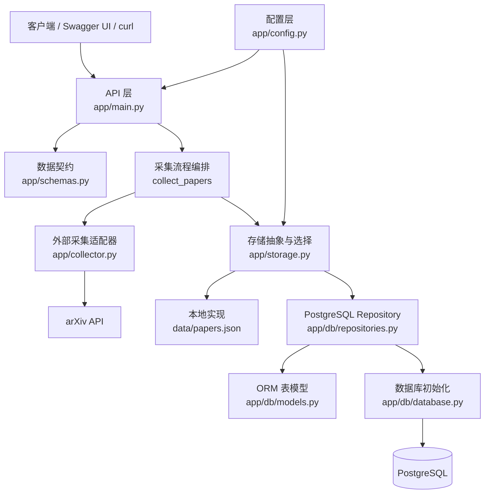
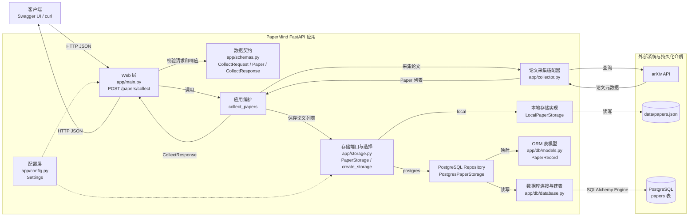
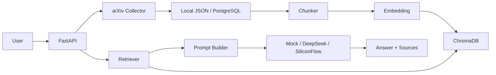

# PaperMind 7月底 AI 应用开发实操手册

> 当前日期：2026-07-08  
> 截止日期：2026-07-31  
> 每日投入：约 4 小时  
> 目标：从 0 搭建一个可以写进简历、可以 GitHub 展示、可以应对实习面试追问的 RAG 项目  
> 项目名：PaperMind  
> 文档定位：不是学习计划，而是可以照着敲代码的实操手册

---

## 0. 你应该怎么使用这份文档

每一天只做三件事：

1. 按当天步骤敲代码。
2. 跑当天验收命令。
3. commit 一次。

不要跳着做。不要一上来就接 LLM API。不要先做前端。  
7 月底前最重要的是完成一个后端 RAG 闭环：

```text
论文采集 -> local/PostgreSQL 保存 -> 文本分块 -> Embedding -> ChromaDB Server 向量检索 -> LLM 回答 -> 返回引用来源
```

---

## 1. 最终你要做出的东西

### 1.1 项目一句话

PaperMind 是一个基于 RAG 的 AI 论文知识库系统。用户输入研究关键词后，系统可以采集论文信息、建立向量知识库，并支持基于论文内容的自然语言问答和引用来源返回。

### 1.2 最终 API

月底前至少实现这些接口：

```text
GET  /health
POST /papers/collect
POST /index/build
POST /search
POST /ask
```

含义：

| 接口 | 作用 |
|---|---|
| `/health` | 检查服务是否正常 |
| `/papers/collect` | 从 arXiv 采集论文 |
| `/index/build` | 把论文摘要切块并写入向量库 |
| `/search` | 对论文库进行 Top-K 语义检索 |
| `/ask` | 基于检索结果调用 LLM 生成回答 |

### 1.3 技术栈

```text
Python 3.11
FastAPI
Pydantic
arxiv
httpx
asyncio
ChromaDB
PostgreSQL
pytest
Docker
DeepSeek API
SiliconFlow API
```

本项目采用一条工程约束：

```text
数据库类基础设施使用 Docker / Docker Compose，FastAPI 使用本机 WSL 的 uv Python 环境运行。
```

这意味着：

- FastAPI 在 WSL 中用 `uv run uvicorn app.main:app --reload` 启动。
- Python 依赖用 `uv` 管理，方便本地开发、调试和测试。
- PostgreSQL 不装在本机，而是在 `postgres` 容器里运行。
- ChromaDB 不使用嵌入式本地模式，而是在 `chroma` 容器里作为独立向量数据库服务运行。
- 测试使用 `uv run pytest -q`，不放进容器里跑。

这样做的收益是：数据库环境可复现，Python 开发反馈快，同时你仍然能熟悉 Docker Compose 管理基础设施服务的方式。

API 说明：

- DeepSeek 官方文档说明 OpenAI 格式 `base_url` 为 `https://api.deepseek.com`，示例 chat endpoint 为 `/chat/completions`。
- SiliconFlow 官方文档说明 OpenAI 兼容 `base_url` 为 `https://api.siliconflow.cn/v1`。
- 模型名称会变化，真实调用前以官方控制台和文档为准。

参考：

- DeepSeek API Docs: https://api-docs.deepseek.com/
- SiliconFlow Quickstart: https://docs.siliconflow.cn/cn/userguide/quickstart

---

## 2. 从 0 创建项目

以下命令默认在 WSL Ubuntu 里执行。

你的已有仓库路径是：

```bash
cd ~/PaperMind
```

如果你想从 0 新建：

```bash
cd ~
mkdir -p PaperMind
cd PaperMind
```

### 2.0 环境预检查

先确认你有这些命令：

```bash
uv --version
docker --version
docker compose version
```

如果 `docker compose version` 失败，先不要继续写代码。这个项目依赖 Docker Compose 启动 PostgreSQL 和 ChromaDB。

再确认 PostgreSQL 和 ChromaDB 的镜像是否已经存在：

```bash
docker image inspect postgres:16 >/dev/null 2>&1 && echo "postgres:16 image exists" || echo "missing postgres:16"

docker image inspect chromadb/chroma:latest >/dev/null 2>&1 && echo "chromadb/chroma:latest image exists" || echo "missing chromadb/chroma:latest"
```

再确认是否已经有本项目的数据库容器：

```bash
docker ps -a --filter "name=papermind-postgres" --format "table {{.Names}}\t{{.Image}}\t{{.Status}}\t{{.Ports}}"

docker ps -a --filter "name=papermind-chroma" --format "table {{.Names}}\t{{.Image}}\t{{.Status}}\t{{.Ports}}"
```

如果只看到表头，没有看到 `papermind-postgres` 或 `papermind-chroma`，说明对应容器还没创建。

如果镜像不存在，先拉取镜像：

```bash
docker pull postgres:16
docker pull chromadb/chroma:latest
```

如果容器不存在，不要手写很长的 `docker run` 命令，后面先创建 `docker-compose.yml`，再用 Compose 统一创建：

```bash
docker compose up -d
```

这样创建出来的容器名会固定为 `papermind-postgres` 和 `papermind-chroma`，后续检查、停止、重启都更稳定。

确认端口没有被占用：

```bash
ss -lntp | grep -E ':5432|:8001|:8000' || true
```

端口用途：

| 端口 | 服务 |
|---|---|
| 5432 | PostgreSQL |
| 8001 | ChromaDB Server |
| 8000 | FastAPI |

如果端口被占用，要么关闭已有服务，要么改 `docker-compose.yml` 和 `.env` 中对应端口。初学阶段建议直接关闭冲突服务，减少变量。

每天开始开发前，建议固定执行：

```bash
cd ~/PaperMind
docker compose up -d
uv run uvicorn app.main:app --reload
```

每天运行测试前，建议确认数据库服务已经启动：

```bash
docker compose ps
uv run pytest -q
```

### 2.1 初始化目录

```bash
mkdir -p app tests data docs
touch app/__init__.py
```

### 2.2 初始化 Python 项目

FastAPI 应用直接使用 WSL 中的 `uv` 环境运行。先初始化项目并安装依赖：

```bash
uv init --python 3.11
uv add fastapi "uvicorn[standard]" arxiv httpx pydantic chromadb sqlalchemy "psycopg[binary]" python-dotenv pytest pytest-asyncio
```

解释：

- `arxiv` 是 arXiv API 的 Python 封装，用于检索论文元数据。
- `chromadb` 是 Python 客户端，用于连接 ChromaDB Server。
- `sqlalchemy` 是 ORM（对象关系映射）框架：用 Python 类描述表和字段，用会话对象读写记录。
- `psycopg[binary]` 是 PostgreSQL 驱动，SQLAlchemy 通过它连接 PostgreSQL。
- `httpx` 后续用于调用 LLM / Embedding 的 OpenAI 兼容 HTTP API，不再用于手写 arXiv XML 解析。
- `python-dotenv` 用于本地 FastAPI 启动时自动读取 `.env`。
- `pytest` 和 `pytest-asyncio` 用于本地测试。

### 2.3 创建 `.gitignore`

文件：`.gitignore`

```gitignore
.venv/
__pycache__/
.pytest_cache/
.env
data/*.json
*.pyc
```

### 2.4 创建 `.env.example`

文件：`.env.example`

```env
LLM_PROVIDER=mock
EMBEDDING_PROVIDER=hash
STORAGE_BACKEND=local

DEEPSEEK_API_KEY=
DEEPSEEK_BASE_URL=https://api.deepseek.com
DEEPSEEK_MODEL=deepseek-v4-flash

SILICONFLOW_API_KEY=
SILICONFLOW_BASE_URL=https://api.siliconflow.cn/v1
SILICONFLOW_MODEL=Qwen/Qwen2.5-72B-Instruct
SILICONFLOW_EMBEDDING_MODEL=BAAI/bge-m3

CHROMA_HOST=localhost
CHROMA_PORT=8001
PAPERS_FILE=data/papers.json
COLLECTION_NAME=papermind

POSTGRES_HOST=localhost
POSTGRES_PORT=5432
POSTGRES_DB=papermind
POSTGRES_USER=papermind
POSTGRES_PASSWORD=papermind
```

说明：

- `LLM_PROVIDER=mock` 表示先不调用真实 LLM。
- `EMBEDDING_PROVIDER=hash` 表示先用本地可跑的 hash embedding。
- `STORAGE_BACKEND=local` 表示论文元数据先保存到本地 JSON。
- `STORAGE_BACKEND=postgres` 表示论文元数据保存到 PostgreSQL。
- `CHROMA_HOST=localhost` 和 `CHROMA_PORT=8001` 表示 FastAPI 从 WSL 本机访问 Docker 暴露出来的 ChromaDB 服务。
- 后续你再切换到 DeepSeek 或 SiliconFlow。

创建本地 `.env`：

```bash
cp .env.example .env
```

后续需要切换 provider 或数据库时，优先改 `.env`，也可以临时用命令前缀覆盖，例如：

```bash
STORAGE_BACKEND=postgres uv run uvicorn app.main:app --reload
```

### 2.5 创建 docker-compose.yml

文件：`docker-compose.yml`

```yaml
services:
  chroma:
    image: chromadb/chroma:latest
    container_name: papermind-chroma
    ports:
      - "8001:8000"
    volumes:
      - chroma_data:/chroma/chroma

  postgres:
    image: postgres:16
    container_name: papermind-postgres
    ports:
      - "5432:5432"
    environment:
      POSTGRES_DB: ${POSTGRES_DB:-papermind}
      POSTGRES_USER: ${POSTGRES_USER:-papermind}
      POSTGRES_PASSWORD: ${POSTGRES_PASSWORD:-papermind}
    volumes:
      - postgres_data:/var/lib/postgresql/data

volumes:
  chroma_data:
  postgres_data:
```

解释：

- `chroma` 是独立 ChromaDB Server，FastAPI 通过 `localhost:8001` 访问。
- `postgres` 是 PostgreSQL，FastAPI 通过 `localhost:5432` 访问。
- `container_name` 固定容器名，方便用 `docker ps -a --filter "name=..."` 检查容器是否已经创建。
- `POSTGRES_DB` 是容器第一次初始化时创建的数据库名。
- `POSTGRES_USER` 是容器第一次初始化时创建的数据库用户名。
- `POSTGRES_PASSWORD` 是这个数据库用户的密码。
- `${POSTGRES_DB:-papermind}` 是 Docker Compose 的变量默认值写法，不是 PostgreSQL 语法。含义是：如果外部环境或 `.env` 里设置了 `POSTGRES_DB`，就使用外部值；如果没有设置，就使用默认值 `papermind`。
- `${POSTGRES_USER:-papermind}` 和 `${POSTGRES_PASSWORD:-papermind}` 同理，分别给用户名和密码设置默认值。
- 开发阶段可以使用默认值 `papermind`；正式部署时不要使用默认密码，应该在 `.env` 中改成更安全的值。
- 这里不放 `api` 服务，因为 FastAPI 用本机 `uv` 环境运行。

### 2.6 启动数据库服务

如果前面的镜像检查显示缺少镜像，可以先让 Compose 按 `docker-compose.yml` 拉取：

```bash
docker compose pull
```

创建并启动 PostgreSQL 与 ChromaDB 容器：

```bash
docker compose up -d
```

确认容器状态：

```bash
docker compose ps
docker ps -a --filter "name=papermind-postgres" --format "table {{.Names}}\t{{.Image}}\t{{.Status}}\t{{.Ports}}"
docker ps -a --filter "name=papermind-chroma" --format "table {{.Names}}\t{{.Image}}\t{{.Status}}\t{{.Ports}}"
```

检查 PostgreSQL：

```bash
docker compose exec postgres pg_isready -U papermind -d papermind
```

预期看到类似：

```text
/var/run/postgresql:5432 - accepting connections
```

检查 ChromaDB：

```bash
curl http://localhost:8001/api/v1/heartbeat
```

如果上面的 heartbeat 路径返回 404，先不要慌，可能是 ChromaDB 镜像版本调整了 HTTP 路径。继续用 Python 客户端检查：

```bash
uv run python -c "import chromadb; c=chromadb.HttpClient(host='localhost', port=8001); print(c.heartbeat())"
```

只要 Python 命令能输出数字或心跳值，就说明 FastAPI 后续可以连接 ChromaDB。

**后文**启动 FastAPI 使用：

```bash
uv run uvicorn app.main:app --reload
```

**后文**运行测试使用：

```bash
uv run pytest -q
```

## 3. 第 1 天：FastAPI 骨架

目标：服务能启动，`/health` 能返回正常结果，测试能通过。

### 3.1 创建配置文件

文件：`app/config.py`

```python
import os
from dataclasses import dataclass
from pathlib import Path
from urllib.parse import quote_plus

from dotenv import load_dotenv


load_dotenv()


def env(name: str, default: str = "") -> str:
    """读取环境变量；未设置时返回给定的默认值。"""
    return os.getenv(name, default)


@dataclass(frozen=True)
class Settings:
    """PaperMind 的运行配置，统一从 .env 或系统环境变量读取。"""

    # Provider 与存储实现可以在不修改业务代码的情况下切换。
    llm_provider: str = env("LLM_PROVIDER", "mock")
    embedding_provider: str = env("EMBEDDING_PROVIDER", "hash")
    storage_backend: str = env("STORAGE_BACKEND", "local")

    # LLM Provider 的连接信息；密钥只从环境变量读取，不能写入源码。
    deepseek_api_key: str = env("DEEPSEEK_API_KEY")
    deepseek_base_url: str = env("DEEPSEEK_BASE_URL", "https://api.deepseek.com")
    deepseek_model: str = env("DEEPSEEK_MODEL", "deepseek-v4-flash")

    siliconflow_api_key: str = env("SILICONFLOW_API_KEY")
    siliconflow_base_url: str = env("SILICONFLOW_BASE_URL", "https://api.siliconflow.cn/v1")
    siliconflow_model: str = env("SILICONFLOW_MODEL", "Qwen/Qwen2.5-72B-Instruct")
    siliconflow_embedding_model: str = env("SILICONFLOW_EMBEDDING_MODEL", "BAAI/bge-m3")

    # 本地 JSON 存储的文件位置。
    papers_file: Path = Path(env("PAPERS_FILE", "data/papers.json"))

    # ChromaDB Server 连接信息。
    chroma_host: str = env("CHROMA_HOST", "localhost")
    chroma_port: int = int(env("CHROMA_PORT", "8001"))
    collection_name: str = env("COLLECTION_NAME", "papermind")

    # PostgreSQL 连接信息；默认值与 docker-compose.yml 保持一致。
    postgres_host: str = env("POSTGRES_HOST", "localhost")
    postgres_port: int = int(env("POSTGRES_PORT", "5432"))
    postgres_db: str = env("POSTGRES_DB", "papermind")
    postgres_user: str = env("POSTGRES_USER", "papermind")
    postgres_password: str = env("POSTGRES_PASSWORD", "papermind")

    @property
    def postgres_url(self) -> str:
        """生成 SQLAlchemy 使用的 PostgreSQL 数据库 URL。"""
        return (
            "postgresql+psycopg://"
            f"{quote_plus(self.postgres_user)}:{quote_plus(self.postgres_password)}"
            f"@{self.postgres_host}:{self.postgres_port}/{self.postgres_db}"
        )
```

解释：

- `Settings` 把所有配置集中起来。`load_dotenv()` 会在本地启动时读取项目根目录的 `.env`；`env()` 则负责“优先使用环境变量，没有时使用默认值”。因此 API key 不会写死在源码中。
- `@dataclass` 是 Python 标准库提供的“数据类”装饰器。它会根据类中的字段自动生成 `__init__`、`__repr__` 等常用方法，所以可以直接写 `Settings()` 来得到一组配置，而不必手写构造函数。
- `frozen=True` 表示实例创建后不能再修改字段。例如 `settings.storage_backend = "postgres"` 会报错。这让配置在程序启动后保持稳定，避免某个模块意外改掉全局连接参数；需要切换配置时，应修改 `.env` 并重启程序。
- `@property` 把一个无参数方法伪装成只读属性。因此调用时写 `settings.postgres_url`，而不是 `settings.postgres_url()`。它适合 `postgres_url` 这种由多个配置字段即时计算得到、无需单独保存的值。
- `storage_backend` 控制论文元数据写入本地 JSON 还是 PostgreSQL。
- `chroma_host` 和 `chroma_port` 指向 Docker 暴露到本机的 ChromaDB Server。
- `postgres_url` 用于连接 Docker 暴露到本机的 PostgreSQL 容器。`postgresql+psycopg://` 明确告诉 SQLAlchemy 使用 PostgreSQL 和 psycopg 驱动；`quote_plus()` 会安全编码用户名或密码中的特殊字符。

### 3.2 创建数据模型

文件：`app/schemas.py`

```python
from pydantic import BaseModel, Field


class Paper(BaseModel):
    """一篇论文的结构化元数据，也是存储层使用的统一对象。"""

    paper_id: str
    title: str
    abstract: str
    authors: list[str] = Field(default_factory=list)
    url: str
    pdf_url: str | None = None
    file_path: str | None = None
    file_hash: str | None = None
    parse_status: str = "metadata_only"
    published: str = ""


class PaperChunk(BaseModel):
    """可写入向量数据库并参与检索的一段论文文本。"""

    chunk_id: str
    paper_id: str
    title: str
    url: str
    pdf_url: str | None = None
    page: int | None = None
    text: str


class CollectRequest(BaseModel):
    """POST /papers/collect 接口接收的采集参数。"""

    query: str = Field(min_length=1)
    max_results: int = Field(default=5, ge=1, le=30)


class CollectResponse(BaseModel):
    """论文采集接口返回的论文列表及数量。"""

    count: int
    papers: list[Paper]


class IndexResponse(BaseModel):
    """建立向量索引后返回的论文数与文本块数。"""

    papers: int
    chunks: int


class SearchRequest(BaseModel):
    """POST /search 接口接收的检索参数。"""

    query: str = Field(min_length=1)
    top_k: int = Field(default=3, ge=1, le=10)


class SearchResult(BaseModel):
    """一次向量检索命中的文本块及其来源信息。"""

    text: str
    title: str
    url: str
    pdf_url: str | None = None
    page: int | None = None
    score: float | None = None


class SearchResponse(BaseModel):
    """检索接口返回的结果列表。"""

    results: list[SearchResult]


class AskRequest(BaseModel):
    """POST /ask 接口接收的问题和检索条数。"""

    question: str = Field(min_length=1)
    top_k: int = Field(default=3, ge=1, le=10)


class Source(BaseModel):
    """RAG 回答中可追溯的一条引用来源。"""

    title: str
    url: str
    pdf_url: str | None = None
    page: int | None = None
    text: str
    score: float | None = None


class AskResponse(BaseModel):
    """RAG 接口返回的回答正文及其引用来源。"""

    answer: str
    sources: list[Source]
```

解释：

- `BaseModel` 来自 Pydantic。它不是 Python 继承的硬性要求，而是本项目对“需要校验、序列化或作为 FastAPI 接口输入输出的数据”采用的统一基类。
- 继承 `BaseModel` 后，Pydantic 会依据类型注解校验和转换输入。例如 `max_results` 只能是 1 到 30 的整数，`query` 不能为空；不满足时 FastAPI 会自动返回清晰的 422 参数错误。
- FastAPI 还能据此自动生成 `/docs` 中的请求体和响应体结构，并可用 `model_dump()` 把模型转换为普通字典，方便写 JSON、数据库或 API 响应。
- 这里的模型都继承 `BaseModel`，是因为它们要么直接表示接口的请求/响应，要么在采集、存储、检索模块间流转，统一后可减少手写校验和字典转换。以后若出现纯业务计算、无需校验或序列化的内部对象，可以使用普通 Python 类或 `@dataclass`，不必为了形式而继承 `BaseModel`。
- `Paper` 是论文的结构化表示。
- `pdf_url`、`file_path`、`file_hash`、`parse_status` 是为后续 PDF 全文解析预留的字段。
- MVP 阶段不下载 PDF，所以 `file_path` 和 `file_hash` 默认为空，`parse_status` 默认为 `metadata_only`。
- `PaperChunk` 是切块后的文本片段。
- 当前 chunk 来自 `title + abstract`，所以 `page` 为空；后续 PDF 分页解析后可以写入页码。
- `SearchResult` 是检索返回结果。
- `AskResponse` 返回回答和引用来源。

### 3.3 创建 FastAPI 入口

文件：`app/main.py`

先建立一个最小概念：**接口（API endpoint）** 是“HTTP 方法 + URL 路径”对应的一段程序逻辑。例如本节的 `GET /health` 表示：客户端用 `GET` 方法访问 `/health` 时，服务运行 `health()` 函数并返回结果。浏览器地址栏通常发送 `GET` 请求，所以可以直接打开这个接口。

```python
from fastapi import FastAPI

# 创建 Web 应用对象；title 和 version 会显示在自动生成的 /docs 页面中。
app = FastAPI(title="PaperMind", version="0.1.0")


# 将 GET /health 这个接口注册到下方的 health 函数。
@app.get("/health")
async def health() -> dict[str, str]:
    """返回服务存活状态，供测试、部署探针和人工检查使用。"""
    return {"status": "ok"}
```

这 5 个新概念分别是：

- `FastAPI` 是框架提供的应用类；`FastAPI(...)` 创建一个 Web 应用对象，变量名 `app` 只是项目约定，可以改名，但后续启动命令也要同步修改。
- `title="PaperMind"` 和 `version="0.1.0"` 是应用元数据，不控制业务逻辑；FastAPI 会把它们展示在 `http://localhost:8000/docs` 的接口文档页中。
- `@app.get("/health")` 是装饰器（decorator）。可以先把它理解为“登记规则”：它把紧随其后的 `health` 函数登记为处理 `GET /health` 请求的函数。后续看到 `@app.post("/xxx")` 时，含义相同，只是请求方法换成了 `POST`。
- `async def` 定义异步函数。现在不需要掌握并发原理，只需知道 FastAPI 可以调用它；当函数里需要等待网络或数据库操作时，异步写法不会阻塞其他请求。
- `return {"status": "ok"}` 返回 Python 字典，FastAPI 会自动把它转换成 JSON，即客户端实际收到 `{"status":"ok"}`。

文档约定：一个框架或第三方 SDK API 第一次出现时，会在紧邻代码处解释“它做什么、何时调用、常用参数、输入和输出是什么”；后文再次使用同一 API 时只保留必要的简短注释，不重复基础概念。

### 3.4 创建第一个测试

文件：`tests/test_health.py`

```python
from fastapi.testclient import TestClient

from app.main import app


def test_health() -> None:
    """健康检查接口应返回 HTTP 200 和预期 JSON。"""
    # TestClient 在进程内调用 FastAPI，无需先启动 uvicorn 服务。
    client = TestClient(app)
    response = client.get("/health")
    # assert 条件为假时会抛出 AssertionError，pytest 将该测试标记为 FAILED。
    assert response.status_code == 200
    assert response.json() == {"status": "ok"}
```

在运行这段代码前，先理解 pytest 做了什么：pytest 是 Python 的测试运行器。执行 `uv run pytest -q` 时，它会默认寻找 `tests/` 目录下文件名为 `test_*.py` 的文件，并执行其中以 `test_` 开头的函数，因此这里会自动发现并运行 `test_health()`。

测试的基本结构是：准备测试对象 -> 执行要验证的代码 -> 用 `assert` 检查结果。这里 `TestClient(app)` 创建一个只供测试使用的客户端；`client.get("/health")` 模拟浏览器或其他程序请求接口；两个 `assert` 分别验证 HTTP 状态码与 JSON 内容。

`assert` 后面的条件为真，测试通过；为假时 Python 会抛出 `AssertionError`，pytest 将测试标记为 `FAILED`，并显示预期值和实际值的差异。例如接口返回 `{"status": "error"}` 时，第二个断言会失败，这正是测试帮助我们发现回归问题的方式。

### 3.5 运行服务

```bash
docker compose up -d
uv run uvicorn app.main:app --reload
```

这条启动命令按从左到右理解：

- `uv run` 表示在本项目的虚拟环境中运行后面的程序，因此会使用通过 `uv add` 安装的 FastAPI 和 Uvicorn。
- `uvicorn` 是实际接收 HTTP 请求的 ASGI 服务器；FastAPI 负责定义接口，Uvicorn 负责把它运行在本机端口上。
- `app.main:app` 的冒号左边是 Python 模块路径：`app/main.py` 对应 `app.main`；右边是该文件中由 `FastAPI(...)` 创建的变量 `app`。Uvicorn 据此找到要运行的 Web 应用。
- `--reload` 用于开发阶段。保存 Python 文件后，Uvicorn 会自动重启服务；正式部署时通常不使用它。

打开：

```text
http://localhost:8000/docs
```

你应该看到 FastAPI 自动生成的接口文档。

### 3.6 运行测试

新开一个终端：

```bash
cd ~/PaperMind
uv run pytest -q
```

预期输出类似：

```text
1 passed
```

### 3.7 提交代码

```bash
git init
git add .
git commit \
  -m "feat: 初始化 FastAPI 项目骨架" \
  -m "- 新增 app/main.py 健康检查接口" \
  -m "- 新增 app/config.py 与 app/schemas.py 基础配置和数据模型" \
  -m "- 新增 tests/test_health.py 覆盖首个接口测试"
```

---

## 4. 第 2 天：论文采集模块

目标：输入关键词，从 arXiv 获取论文标题、摘要、作者、链接和发布时间。

### 4.1 创建采集模块

文件：`app/collector.py`

```python
import asyncio

import arxiv

from app.schemas import Paper


# 复用客户端，并显式限制请求频率和重试次数，避免短时间连续请求 arXiv。
_ARXIV_CLIENT = arxiv.Client(page_size=10, delay_seconds=4.0, num_retries=1)


def clean_text(text: str | None) -> str:
    """压缩空白字符，将 arXiv 返回的文本规范为单行内容。"""
    if not text:
        return ""
    return " ".join(text.split())


def result_to_paper(result: arxiv.Result) -> Paper:
    """将一个 arxiv.Result 的常用元数据转换为项目内部的 Paper 模型。"""
    authors = [clean_text(author.name) for author in result.authors]
    authors = [name for name in authors if name]

    return Paper(
        paper_id=result.get_short_id(),
        title=clean_text(result.title),
        abstract=clean_text(result.summary),
        authors=authors,
        url=result.entry_id,
        pdf_url=result.pdf_url,
        parse_status="metadata_only",
        published=result.published.isoformat(),
    )


def _collect_arxiv_sync(query: str, max_results: int = 5) -> list[Paper]:
    """在线程中调用共享 arXiv 客户端，按提交时间倒序获取论文。"""
    search = arxiv.Search(
        query=query,
        max_results=max_results,
        sort_by=arxiv.SortCriterion.SubmittedDate,
        sort_order=arxiv.SortOrder.Descending,
    )
    try:
        return [result_to_paper(result) for result in _ARXIV_CLIENT.results(search)]
    except arxiv.HTTPError as exc:
        if exc.status == 429:
            raise RuntimeError(
                "arXiv API 暂时拒绝请求（HTTP 429）。停止重复运行，等待至少 60 秒后再试；"
                "同时确认没有其他脚本或服务在使用同一网络出口请求 arXiv。"
            ) from None
        raise


async def collect_arxiv(query: str, max_results: int = 5) -> list[Paper]:
    """异步采集入口，避免同步 SDK 调用阻塞 FastAPI 事件循环。"""
    return await asyncio.to_thread(_collect_arxiv_sync, query, max_results)
```

解释：

- `arxiv.Client` 负责请求 arXiv API，不需要自己拼 URL、请求 XML、解析 Atom feed。
- `_ARXIV_CLIENT` 是进程内复用的客户端。`page_size=10` 表示一次底层 HTTP 请求最多取 10 条原始结果，`delay_seconds=4.0` 表示相邻请求至少间隔 4 秒，`num_retries=1` 表示网络错误最多额外尝试一次。arXiv 官方建议连续请求间隔至少 3 秒；本教程额外留出缓冲。[arXiv API 使用手册](https://info.arxiv.org/help/api/user-manual.html)
- `arxiv.Search` 只是一份“查询说明书”，并不立即发请求。`query` 是搜索表达式，`max_results` 是这次调用最终最多返回多少篇，`sort_by` 是排序字段，`sort_order` 是升序或降序。`_ARXIV_CLIENT.results(search)` 才会真正访问网络并逐个产出 `arxiv.Result`。
- `page_size` 与 `max_results` 不同：前者控制单次 HTTP 请求取多少条，后者控制 `collect_arxiv()` 最终交给调用方多少篇。因此传入 `max_results=2` 时，旧代码的请求 URL 中仍出现 `max_results=100`，是因为旧客户端的 `page_size` 为 100；这不是“要返回 100 篇”，但会造成不必要的单页请求量。
- `result_to_paper` 只负责把 `arxiv.Result` 转成项目自己的 `Paper` 模型。
- `asyncio.to_thread` 把同步的 `arxiv` 包调用放到线程里执行，避免在 FastAPI 的 async 接口里直接阻塞事件循环。
- `clean_text` 去除标题、摘要和作者中的多余换行与空格。
- `pdf_url` 只是记录 PDF 下载地址，不代表当前已经下载 PDF。
- `parse_status="metadata_only"` 表示当前只完成元数据采集，后续 PDF 下载和全文解析再更新状态。
- 采集模块只负责采集，不负责保存，也不负责 API。

#### `arxiv.Result` 是什么

`arxiv.Result` 代表 arXiv API 响应 Atom feed 中的一篇论文条目，不是本项目自己定义的 `Paper`。它包含的字段很多；PaperMind 只读取当前阶段需要的部分：

| `arxiv.Result` 字段或方法 | 类型 / 结构 | 本节如何使用 |
| --- | --- | --- |
| `entry_id` | `str`，论文摘要页 URL | 写入 `Paper.url` |
| `get_short_id()` | 方法，返回如 `2401.00001v1` 的 arXiv ID | 写入 `Paper.paper_id`，用于去重 |
| `title` | `str` | 清理空白后写入标题 |
| `summary` | `str` | 清理空白后写入摘要 |
| `authors` | `list[arxiv.Result.Author]` | 遍历列表，读取每个 `author.name` |
| `published` | 带时区的 `datetime` | 用 `.isoformat()` 转成可存 JSON 的字符串 |
| `pdf_url` | `str | None` | 写入 PDF 链接；它可能为空 |

此外，`updated`、`primary_category`、`categories`、`comment`、`journal_ref`、`doi` 也在 `arxiv.Result` 中，但当前 RAG 最小闭环尚不使用。`arxiv.Result.Author` 除了 `name` 外还可能有 `affiliation`；本节只保存作者名。字段定义可见 [arxiv.py 的 Result 源码](https://github.com/lukasschwab/arxiv.py/blob/master/arxiv/__init__.py) 与 [arXiv API 响应说明](https://info.arxiv.org/help/api/user-manual.html)。

#### 与 `E:\arXivCrawler` 的对应关系

`arXivCrawler` 是这一步的可运行采集原型：`main.py -> src/crawler.py -> src/parser.py -> src/models.py -> src/storage.py`。其中 `src/crawler.py` 负责调用 arXiv，`src/parser.py` 专门把 `arxiv.Result` 转换为内部 `Paper`，与本节的 `_collect_arxiv_sync()` 和 `result_to_paper()` 分别对应。

PaperMind 在第 2 天暂时把这两个职责放在同一个 `app/collector.py`，原因是当前只需要最小字段集（标题、摘要、作者、链接和发布时间）来支撑后续的 API、分块和 RAG。`arXivCrawler` 中的按 ID 批量查询、惰性迭代、分类、DOI 和期刊引用字段都很有价值，但应在需要这些能力时再拆出 `app/parser.py` 并扩展 `Paper`，而不是在第一天就增加学习负担。

### 4.2 写采集转换测试

文件：`tests/test_collector.py`

```python
from datetime import datetime, timezone

import arxiv

from app.collector import result_to_paper


def test_result_to_paper() -> None:
    """arXiv 返回对象应完整转换为项目的 Paper 模型。"""
    result = arxiv.Result(
        entry_id="https://arxiv.org/abs/2401.00001v1",
        published=datetime(2024, 1, 1, tzinfo=timezone.utc),
        title=" Test Paper ",
        authors=[arxiv.Result.Author("Alice"), arxiv.Result.Author("Bob")],
        summary=" This is a test abstract. ",
        links=[
            arxiv.Result.Link(
                href="https://arxiv.org/pdf/2401.00001v1",
                title="pdf",
                content_type="application/pdf",
            )
        ],
    )

    paper = result_to_paper(result)

    assert paper.paper_id == "2401.00001v1"
    assert paper.title == "Test Paper"
    assert paper.authors == ["Alice", "Bob"]
    assert paper.pdf_url == "https://arxiv.org/pdf/2401.00001v1"
    assert paper.parse_status == "metadata_only"
```

这段测试没有访问网络，而是手工构造一个 `arxiv.Result`。`entry_id` 是必填的论文摘要页 URL；`published` 使用带时区的 `datetime`；`authors` 需要传入 `arxiv.Result.Author` 对象列表；`links` 中 `title="pdf"` 且 `content_type="application/pdf"` 的链接会被 `arxiv.py` 识别为 `result.pdf_url`。因此这个测试专门验证“第三方对象转项目模型”，不会受到网络或 429 限流影响。

### 4.3 运行测试

```bash
uv run pytest -q
```

预期：

```text
2 passed
```

### 4.4 手动测试采集

先运行不访问网络的转换测试：

```bash
uv run pytest -q tests/test_collector.py
```

再只执行一次在线采集：

```bash
uv run python -c "import asyncio; from app.collector import collect_arxiv; papers = asyncio.run(collect_arxiv('cat:cs.CL AND all:rag', 1)); print([(paper.paper_id, paper.title) for paper in papers])"
```

如果网络正常，你会看到一条 `(paper_id, title)` 元组。`cat:cs.CL` 将搜索限定在计算与语言类别，`all:rag` 在全部字段搜索 `rag`；这两个是 arXiv 查询表达式，而不是 Python 特殊语法。

测试返回内容：
```bash	
[('2607.09349v1', 'Deceptive Grounding: Entity Attribution Failure in Clinical Retrieval-Augmented Generation')]
```

如果出现 `HTTP 429`，说明 arXiv 暂时限制了当前网络出口的请求。不要连续重复执行命令，也不要以“把结果数从 2 改成 1”作为绕过方法；先停止其他可能访问 arXiv 的脚本或服务，等待至少 60 秒，再只重试一次。新版示例会将 429 转成更简明的 `RuntimeError`。如果仍然失败，先继续做本地转换测试和 mock 流程，稍后再验证真实采集。429 是上游限流，不是 `asyncio.to_thread` 或 `Paper` 转换代码出错。

---

## 5. 第 3 天：论文数据存储层

目标：把采集到的论文保存起来，并支持两种存储方式：

```text
STORAGE_BACKEND=local     -> 保存到 data/papers.json
STORAGE_BACKEND=postgres  -> 保存到 PostgreSQL
```

为什么要同时支持两种方式：

- `local` 适合快速调试，文件可直接查看。
- `postgres` 更接近真实后端项目，能体现数据库建表、连接、去重、结构化存储能力。

### 5.1 创建存储模块

先创建 `app/db/` 数据库子包。ORM（对象关系映射）把数据库中的一行记录映射为 Python 对象：`PaperRecord` 对应 `papers` 表的一行，`PaperRecord.title` 对应这一行的 `title` 列。这样先认识表模型和会话，再进入存储层的读写逻辑。

文件：`app/db/__init__.py`

```python
"""PaperMind 的数据库子包。"""
```

文件：`app/db/models.py`

```python
from datetime import datetime

from sqlalchemy import DateTime, String, Text, func
from sqlalchemy.dialects.postgresql import JSONB
from sqlalchemy.orm import DeclarativeBase, Mapped, mapped_column


class Base(DeclarativeBase):
    """PaperMind 所有 ORM 表模型的共同基类。"""


class PaperRecord(Base):
    """映射 PostgreSQL 的 papers 表，保存一篇论文的持久化字段。"""

    __tablename__ = "papers"

    paper_id: Mapped[str] = mapped_column(String, primary_key=True)
    title: Mapped[str] = mapped_column(Text, nullable=False)
    abstract: Mapped[str] = mapped_column(Text, nullable=False)
    authors: Mapped[list[str]] = mapped_column(JSONB, nullable=False, default=list)
    url: Mapped[str] = mapped_column(Text, nullable=False)
    pdf_url: Mapped[str | None] = mapped_column(Text, nullable=True)
    file_path: Mapped[str | None] = mapped_column(Text, nullable=True)
    file_hash: Mapped[str | None] = mapped_column(String, nullable=True)
    parse_status: Mapped[str] = mapped_column(String, nullable=False, default="metadata_only")
    published: Mapped[str] = mapped_column(String, nullable=False, default="")
    created_at: Mapped[datetime] = mapped_column(
        DateTime(timezone=True), server_default=func.now(), nullable=False
    )
    updated_at: Mapped[datetime] = mapped_column(
        DateTime(timezone=True), server_default=func.now(), nullable=False
    )
```

文件：`app/db/database.py`

```python
from sqlalchemy import create_engine
from sqlalchemy.engine import Engine

from app.db.models import Base


def init_db(database_url: str) -> Engine:
    """创建引擎，并创建尚不存在的表；不会修改已有表的结构。"""
    engine = create_engine(database_url, pool_pre_ping=True)
    Base.metadata.create_all(engine)
    return engine
```

文件：`app/db/repositories.py`

```python
from sqlalchemy import func, select
from sqlalchemy.dialects.postgresql import insert
from sqlalchemy.orm import Session

from app.db.database import init_db
from app.db.models import PaperRecord
from app.schemas import Paper


class PostgresPaperStorage:
    """以 SQLAlchemy ORM 实现 PostgreSQL 论文存储。"""

    def __init__(self, database_url: str) -> None:
        """创建引擎，并初始化本地开发所需的 ORM 表。"""
        self.engine = init_db(database_url)

    def load_all(self) -> list[Paper]:
        """通过 ORM 查询 papers 表，并转换回项目的 Paper 模型。"""
        with Session(self.engine) as session:
            records = session.scalars(
                select(PaperRecord).order_by(PaperRecord.published.desc())
            ).all()
        return [
            Paper(
                paper_id=record.paper_id,
                title=record.title,
                abstract=record.abstract,
                authors=list(record.authors or []),
                url=record.url,
                pdf_url=record.pdf_url,
                file_path=record.file_path,
                file_hash=record.file_hash,
                parse_status=record.parse_status,
                published=record.published,
            )
            for record in records
        ]

    def save_many(self, papers: list[Paper]) -> list[Paper]:
        """按 paper_id 执行 ORM upsert，避免重复采集产生重复记录。"""
        with Session(self.engine) as session:
            for paper in papers:
                payload = paper.model_dump()
                statement = insert(PaperRecord).values(**payload)
                statement = statement.on_conflict_do_update(
                    index_elements=[PaperRecord.paper_id],
                    set_={
                        key: value
                        for key, value in payload.items()
                        if key != "paper_id"
                    } | {"updated_at": func.now()},
                )
                session.execute(statement)
            session.commit()
        return self.load_all()
```

文件：`app/storage.py`

```python
import json
from pathlib import Path
from typing import Protocol

from app.config import Settings
from app.db.repositories import PostgresPaperStorage
from app.schemas import Paper


class PaperStorage(Protocol):
    """存储层契约：调用方只依赖读写论文的能力，不依赖具体介质。"""

    def load_all(self) -> list[Paper]:
        """读取当前后端中的全部论文。"""
        ...

    def save_many(self, papers: list[Paper]) -> list[Paper]:
        """按 paper_id 保存或更新论文，并返回保存后的全部论文。"""
        ...


class LocalPaperStorage:
    """以 JSON 文件实现 PaperStorage，适合本地开发和调试。"""

    def __init__(self, path: Path) -> None:
        """初始化数据文件路径，并确保其父目录存在。"""
        self.path = path
        self.path.parent.mkdir(parents=True, exist_ok=True)

    def load_all(self) -> list[Paper]:
        """从 JSON 文件恢复 Paper 列表；文件不存在时返回空列表。"""
        if not self.path.exists():
            return []
        data = json.loads(self.path.read_text(encoding="utf-8"))
        return [Paper(**item) for item in data]

    def save_many(self, papers: list[Paper]) -> list[Paper]:
        """以 paper_id 去重合并后，将完整列表写回 JSON 文件。"""
        existing = {paper.paper_id: paper for paper in self.load_all()}
        for paper in papers:
            existing[paper.paper_id] = paper
        all_papers = list(existing.values())
        payload = [paper.model_dump() for paper in all_papers]
        self.path.write_text(
            json.dumps(payload, ensure_ascii=False, indent=2),
            encoding="utf-8",
        )
        return all_papers


def create_storage(settings: Settings) -> PaperStorage:
    """根据配置选择本地 JSON 或 PostgreSQL 存储实现。"""
    if settings.storage_backend == "postgres":
        return PostgresPaperStorage(settings.postgres_url)
    return LocalPaperStorage(settings.papers_file)
```

解释：

- `app/db/models.py` 只定义数据库模型。`Base` 是 SQLAlchemy 的 ORM 基类；继承它的 `PaperRecord` 是“表模型”，`__tablename__ = "papers"` 指定它映射到 PostgreSQL 的 `papers` 表。
- `Mapped[T]` 表示一个 ORM 字段的 Python 类型，`mapped_column(...)` 则补充主键、可空性和数据库列类型等映射规则。例如 `paper_id` 是字符串主键，`authors` 是 PostgreSQL `JSONB` 列。
- `app/db/database.py` 只负责初始化数据库。`init_db()` 中的 `create_engine()` 创建连接池和数据库方言配置，`Base.metadata.create_all()` 根据表模型创建缺失的表。它不执行已有表的结构升级，因此不能替代迁移工具。
- `Session` 是一次数据库工作单元：`session.scalars(select(PaperRecord))` 查询 ORM 对象；`session.commit()` 提交本次写入。
- `insert(PaperRecord)` 从表模型生成 PostgreSQL 插入语句，`on_conflict_do_update(...)` 保留 PostgreSQL 的 upsert 能力，但列名不再手写在三段 SQL 字符串中。
- `app/db/repositories.py` 中的 `PostgresPaperStorage` 负责查询、upsert，以及将 ORM 的 `PaperRecord` 与业务层的 Pydantic `Paper` 相互转换。两者不是重复定义：前者描述数据库表，后者描述 API、采集和 RAG 流程中传递的数据。
- `app/storage.py` 保留 `PaperStorage` 接口、`LocalPaperStorage` 和 `create_storage()`。`LocalPaperStorage` 使用 JSON 文件保存论文；两种存储都实现 `load_all` 和 `save_many`，所以 API 层不需要关心底层存储。
- `pdf_url`、`file_path`、`file_hash`、`parse_status` 暂时只预留，MVP 阶段仍然基于 title + abstract 做摘要级 RAG。

#### ORM 与迁移的边界

本项目从第 3 天就使用 ORM，而不是把 DDL 或查询 SQL 内嵌在存储层。这样你会从一开始接触“业务模型 `Paper`、数据库模型 `PaperRecord`、存储接口 `PaperStorage`”这三个不同职责的对象。

不过 ORM 不等于不需要理解 SQL：`PaperRecord` 会被 SQLAlchemy 编译成 DDL，`select()` 和 `insert()` 会被编译成 DML。你仍然可以用 `psql` 查看真实表和数据；只是表结构与查询意图由类型化 Python 代码表达，减少手写字符串的重复和拼写错误。

| 层次 | 放置位置 | 解决的问题 | PaperMind 当前策略 |
| --- | --- | --- | --- |
| ORM 表模型 | `app/db/models.py` | 用 Python 类集中描述表、字段、主键和类型 | 第 3 天立即采用 SQLAlchemy |
| 数据库初始化 | `app/db/database.py` | 创建引擎并根据模型创建缺失的表 | 第 3 天立即采用 |
| PostgreSQL Repository | `app/db/repositories.py` | 查询、upsert，以及 ORM 与业务模型之间的转换 | 第 3 天立即采用 |
| 存储接口与本地实现 | `app/storage.py` | 定义统一接口、实现 JSON 存储并选择后端 | 第 3 天立即采用 |
| 版本化迁移 | `alembic/versions/` | 已部署数据库的可追踪结构升级 | 表结构第一次变化时引入 Alembic |

`app/db/` 是数据库相关代码的稳定边界，`app/storage.py` 则面向上层提供统一的存储入口。`Base.metadata.create_all()` 适合首次创建本地空数据库；一旦数据库已经存在且模型发生字段变化，它不会自动执行 `ALTER TABLE`。那时使用 Alembic：新增模型字段 -> 生成一份迁移文件 -> 在测试和生产环境按相同顺序执行。`E:\arXivCrawler\src\database.py` 采用的也是“SQLAlchemy 表模型与存储层分离”的方向，本节据此保留了最小可运行版本。

### 5.2 写存储测试

文件：`tests/test_storage.py`

```python
from app.schemas import Paper
from app.storage import LocalPaperStorage


def test_storage_save_and_load(tmp_path) -> None:
    """本地存储应能将 Paper 写入 JSON 后无损读回。"""
    storage = LocalPaperStorage(tmp_path / "papers.json")
    paper = Paper(
        paper_id="p1",
        title="Title",
        abstract="Abstract",
        authors=["Alice"],
        url="https://example.com/p1",
        pdf_url="https://example.com/p1.pdf",
        parse_status="metadata_only",
        published="2024",
    )

    storage.save_many([paper])
    loaded = storage.load_all()

    assert len(loaded) == 1
    assert loaded[0].paper_id == "p1"
    assert loaded[0].pdf_url == "https://example.com/p1.pdf"
    assert loaded[0].parse_status == "metadata_only"
```

### 5.3 运行测试

```bash
uv run pytest -q
```

### 5.4 手动测试 PostgreSQL 存储

先启动服务：

```bash
docker compose up -d
```

新开一个终端，查看 PostgreSQL：

```bash
docker compose exec postgres psql -U papermind -d papermind
```

在 psql 中执行：

```sql
\dt
select count(*) from papers;
\d papers
```

如果你还没有切换到 `STORAGE_BACKEND=postgres`，表可能还没创建。切换方式：

```bash
STORAGE_BACKEND=postgres uv run uvicorn app.main:app --reload
```

然后调用采集接口：

```bash
curl -X POST http://localhost:8000/papers/collect \
  -H "Content-Type: application/json" \
  -d '{"query":"retrieval augmented generation","max_results":3}'
```

然后调用 `/papers/collect`，再查询：

```sql
select paper_id, title, pdf_url, file_path, parse_status from papers limit 5;
```

如果能看到论文标题、`pdf_url`，且 `parse_status` 为 `metadata_only`，说明 PostgreSQL 存储后端已经跑通。

切回 local JSON：

```bash
STORAGE_BACKEND=local uv run uvicorn app.main:app --reload
```

再次调用 `/papers/collect` 后，检查：

```bash
cat data/papers.json
```

如果文件里出现论文列表，说明 local 存储后端也跑通。

### 5.5 补充：ORM 基础、建表触发条件与 API 学习边界

第 3 天已经完成；本节补充 ORM 的基础概念，并纠正手动验证时容易混淆的两个学习阶段。

#### 为什么所有表模型都继承 `DeclarativeBase`

`DeclarativeBase` 是 SQLAlchemy 2.x 的“声明式映射”基类。`class Base(DeclarativeBase)` 不是为了给 `PaperRecord` 增加普通的 Python 方法，而是为了让 SQLAlchemy 收集所有继承 `Base` 的表模型及其字段定义，形成共享的 `Base.metadata`。

关系可以理解为：

```text
DeclarativeBase
      |
      v
    Base --------------> Base.metadata（本项目全部表的目录）
      |
      +--> PaperRecord -> papers 表
      +--> 未来的其他记录模型 -> 对应的其他表
```

`Base.metadata.create_all(engine)` 正是读取这个“表目录”，为其中尚不存在的表生成 `CREATE TABLE`。如果每个模型各自继承不同的基类，表会分散在不同的 `metadata` 中；初始化时必须逐个处理，迁移工具也难以把它们作为同一个数据库模式管理。因此一个项目通常只定义一个项目级 `Base`，全部 ORM 表模型都继承它。

`Paper` 不继承 `Base`，因为它是 Pydantic 的业务数据模型，不是数据库表；`PaperRecord` 才继承 `Base`，因为它要映射到 PostgreSQL 的 `papers` 表。

#### `JSONB` 是什么

`JSONB` 是 PostgreSQL 专用的 JSON 数据列类型。它存储的是 PostgreSQL 已解析后的二进制 JSON 表示，适合保存结构不复杂、但不值得单独拆表的数组或对象。这里的 `authors: list[str]` 会以 JSON 数组保存，例如：

```json
["Alice", "Bob"]
```

SQLAlchemy 会把 Python 的 `list[str]` 转成 JSONB，也会在查询结果中还原为 Python 列表，因此本项目不需要手动 `json.dumps()` 或 `json.loads()`。在 `psql` 中可这样查看作者数组及其第一个元素：

```sql
SELECT authors, authors ->> 0 AS first_author
FROM papers
LIMIT 5;
```

PostgreSQL 还有 `JSON` 类型。对本项目而言，`JSONB` 更适合作为默认选择：它支持更丰富的查询运算符和索引能力；代价是它是 PostgreSQL 特有类型，不能原样迁移到 SQLite 等其他数据库。作者列表目前只是论文的一部分字段，尚不需要按作者做复杂关联查询，所以使用 JSONB 比额外创建 `authors` 表更简单。以后若需要“按作者筛选、作者主页、作者与论文的多对多关系”，再把作者拆成独立表。

#### ORM 最小使用流程

下面的示例使用本项目现有的 `PaperRecord`，展示 ORM 最常见的四步：定义模型、创建表、写入、查询。这个示例用于理解 API；项目的正式读写仍应通过 `PostgresPaperStorage`，不要在业务路由中到处复制 `Session` 代码。

```python
from sqlalchemy import select
from sqlalchemy.orm import Session

from app.config import Settings
from app.db.database import init_db
from app.db.models import PaperRecord


def run_orm_basics() -> None:
    """演示创建表、插入一条记录并以 ORM 对象查询它。"""
    engine = init_db(Settings().postgres_url)

    with Session(engine) as session:
        record = PaperRecord(
            paper_id="orm-demo-001",
            title="ORM demo",
            abstract="A record created only to demonstrate SQLAlchemy ORM.",
            authors=["PaperMind"],
            url="https://example.com/orm-demo-001",
        )
        session.add(record)
        session.commit()

    with Session(engine) as session:
        statement = select(PaperRecord).where(
            PaperRecord.paper_id == "orm-demo-001"
        )
        saved_record = session.scalars(statement).one()
        print(saved_record.title)
```

执行顺序和 API：

| 步骤 | 代码 | 含义 |
| --- | --- | --- |
| 定义模型 | `class PaperRecord(Base)` | 声明 Python 类、字段和 `papers` 表之间的映射；此时尚未连接数据库。 |
| 创建引擎 | `create_engine(url)` | 创建连接池和数据库方言配置，返回 `Engine`。 |
| 创建缺失表 | `Base.metadata.create_all(engine)` | 根据已注册到 `Base.metadata` 的模型执行必要的 `CREATE TABLE`。 |
| 开启工作单元 | `with Session(engine) as session` | 创建一次数据库操作上下文；退出 `with` 后会关闭会话。 |
| 新增对象 | `session.add(record)` | 将 ORM 对象标记为待插入；此时 SQL 还不一定已经提交。 |
| 提交事务 | `session.commit()` | 将本次变更写入数据库。异常时应使用 `session.rollback()` 放弃未提交的变更。 |
| 查询对象 | `session.scalars(select(PaperRecord))` | 执行 `SELECT`，结果中的每一项都是 `PaperRecord` 对象，而不是手写解析的字典。 |

`mapped_column(...)` 处理“这一列如何建表”，`Session` 处理“一次读写操作如何提交”，`select(...)` 处理“要查询哪些行”。这三个角色不要混淆。可在阅读完本节后对照 SQLAlchemy 的 [ORM Quick Start](https://docs.sqlalchemy.org/en/20/orm/quickstart.html)；其中的顺序也是模型、引擎、建表、`Session`、查询。

#### 为什么启动后没有创建 `papers` 表

第 3 天的 `app/main.py` 仍然只有 `GET /health`。虽然 `PostgresPaperStorage.__init__()` 会调用 `init_db()`，但只有先执行 `create_storage(Settings())` 并选择 `postgres` 后，才会创建 `PostgresPaperStorage`。仅运行：

```bash
STORAGE_BACKEND=postgres uv run uvicorn app.main:app --reload
```

只是在启动前设置了环境变量；第 3 天的应用入口没有读取它来创建存储对象，因此 `init_db()` 没有被调用，表自然不会出现。

在尚未学习第 4 天 API 前，用下面的独立命令验证建表。它会构造 PostgreSQL 存储对象，从而触发 `init_db()`：

```bash
STORAGE_BACKEND=postgres uv run python -c "from app.config import Settings; from app.storage import create_storage; create_storage(Settings()); print('PostgreSQL tables initialized')"
```

再检查：

```bash
docker compose exec postgres psql -U papermind -d papermind -c "\\dt"
docker compose exec postgres psql -U papermind -d papermind -c "\\d papers"
```

这一步只创建空表，不会采集或写入论文。

#### 为什么 `POST /papers/collect` 返回 404

`404 Not Found` 表示当前运行的 FastAPI 应用中没有匹配的“HTTP 方法 + 路径”。第 3 天只注册了 `GET /health`；`POST /papers/collect` 要到第 4 天的 `6.1 替换 app/main.py` 才被 `@app.post("/papers/collect")` 注册。因此在第 3 天执行该 `curl` 命令得到 404 是预期行为。

第 3 天可验证的 HTTP 接口只有：

```bash
curl http://localhost:8000/health
```

预期响应：

```json
{"status":"ok"}
```

完成第 4 天并重启 Uvicorn 后，再执行 `POST /papers/collect`。届时接口会采集论文、调用 `storage.save_many(...)`，并把数据写入当前选择的 JSON 或 PostgreSQL 存储后端。

---

## 6. 第 4 天：采集 API

目标：通过 FastAPI 调用采集模块，并保存论文。

### 6.1 替换 `app/main.py`

文件：`app/main.py`

```python
from fastapi import FastAPI, HTTPException

from app.collector import collect_arxiv
from app.config import Settings
from app.schemas import CollectRequest, CollectResponse
from app.storage import create_storage

# 在应用启动时读取配置，并选择对应的论文存储后端。
settings = Settings()
storage = create_storage(settings)

app = FastAPI(title="PaperMind", version="0.1.0")


@app.get("/health")
async def health() -> dict[str, str]:
    """返回服务存活状态，供测试、部署探针和人工检查使用。"""
    return {"status": "ok"}


@app.post("/papers/collect", response_model=CollectResponse)
async def collect_papers(request: CollectRequest) -> CollectResponse:
    """采集 arXiv 论文并保存；上游请求失败时转换为 HTTP 502。"""
    try:
        papers = await collect_arxiv(request.query, request.max_results)
    except Exception as exc:
        raise HTTPException(status_code=502, detail=f"paper collection failed: {exc}") from exc

    storage.save_many(papers)
    return CollectResponse(count=len(papers), papers=papers)
```

说明：

- `@app.post("/papers/collect")` 首次注册 `POST` 接口。与 `GET` 相比，`POST` 通常用于把一段请求数据交给服务处理；这里的数据是用户给出的采集关键词和数量。
- `request: CollectRequest` 表示 FastAPI 会把请求体中的 JSON 转换为 `CollectRequest`。例如 `{"query": "rag", "max_results": 3}`；字段缺失或不满足模型中的限制时，函数不会执行，FastAPI 会自动返回 422 错误。
- `response_model=CollectResponse` 表示接口输出必须符合 `CollectResponse` 结构。它既用于校验和过滤返回数据，也会把响应格式写进 `/docs`。
- `HTTPException(status_code=502, ...)` 是告诉 FastAPI 返回一个 HTTP 错误响应，而不是让 Python 异常直接中断服务。`502` 在这里表示依赖的 arXiv 上游请求失败。
- 现在 API 层已经能完成“采集 + 保存”。
- `storage.save_many(papers)` 只负责持久化；接口响应仍只返回本次采集到的论文。

### 6.2 启动服务

```bash
docker compose up -d
uv run uvicorn app.main:app --reload
```

打开：

```text
http://localhost:8000/docs
```

在 `/papers/collect` 中输入：

```json
{
  "query": "Generative false information",
  "max_results": 3
}
```

预期：

- 返回 3 篇左右论文。
- 本地出现 `data/papers.json`。

### 6.3 提交

```bash
uv run pytest -q

git add app/collector.py app/storage.py app/main.py
git add app/db/__init__.py app/db/models.py app/db/database.py app/db/repositories.py
git add tests/test_collector.py tests/test_storage.py
git diff --cached --name-only
git diff --cached --stat
git diff --cached --name-status
git commit \
  -m "feat: 完成论文采集与存储链路" \
  -m "- 封装 arXiv 论文采集与元数据转换" \
  -m "- 实现 JSON 和 PostgreSQL ORM 两种论文存储" \
  -m "- 注册 POST /papers/collect 并编排采集保存流程" \
  -m "- 覆盖采集转换和存储层读写测试"
```

第 1 天已经提交了 FastAPI 骨架；这一次统一提交第 2 至第 4 天尚未提交的采集和存储链路。提交前的三个 `git diff --cached` 命令分别确认：暂存了哪些文件、改动规模，以及新增/修改/删除类型。若你的实际改动与这里列出的文件不一致，应逐个调整 `git add <文件路径>`，并让提交说明与最终暂存内容一致；不要因为方便而使用 `git add .`。

### 6.4 补充：当前项目的分层与调用方向

PaperMind 现在的模块数量不多，但已经有清晰的职责分层。它和 Spring Boot 的 Controller、Service、Repository、Entity、DTO 并非文件名一一对应，但解决的是同一个问题：让 HTTP、业务流程、外部依赖和数据存储不要混在一个函数里。



各层的作用：

| 当前模块 | 分层职责 | Spring Boot 中的近似角色 | 这一层应关注什么 |
| --- | --- | --- | --- |
| `app/main.py` | API / Web 层 | `Controller` | 注册 URL、接收 HTTP 请求、返回 HTTP 响应；不直接写 SQL。 |
| `CollectRequest`、`CollectResponse`、`Paper` | 数据契约层 | DTO；`Paper` 在流程中也承担业务数据对象角色 | 请求和响应的字段、校验、序列化；不关心网络请求和数据库连接。 |
| `collect_papers()` | 当前的应用服务编排 | `Service` 中的一项用例 | 把“采集 -> 保存 -> 响应”串起来，决定调用顺序。第 4 天先放在路由函数中，流程复杂后再独立为 service 模块。 |
| `app/collector.py` | 外部服务适配层 | 调用第三方 SDK 的 client / gateway | 如何调用 arXiv，如何把 `arxiv.Result` 转成项目的 `Paper`；不处理 HTTP 路由。 |
| `PaperStorage`、`create_storage()` | 存储端口与实现选择 | Repository 接口加配置装配 | 上层只依赖“读写论文”的能力，不依赖 JSON 或 PostgreSQL。 |
| `LocalPaperStorage`、`PostgresPaperStorage` | 基础设施实现层 | Repository 实现 | 分别把论文写入 JSON 或 PostgreSQL；不决定 API 返回格式。 |
| `app/db/models.py` | 持久化模型层 | JPA Entity | 描述 `papers` 表、列和类型；`PaperRecord` 不作为 HTTP 响应直接返回。 |
| `app/db/database.py` | 数据库连接与模式初始化 | `DataSource` / JPA 配置 | 创建 `Engine`，并在本地开发时创建缺失的表。 |
| `app/config.py` | 配置层 | `application.yml` 加 `@ConfigurationProperties` | 集中读取环境变量，决定使用哪个存储后端和连接地址。 |

一次 `POST /papers/collect` 的具体调用链是：

```text
HTTP 请求
  -> app.main.collect_papers()
  -> collector.collect_arxiv()
  -> arXiv API
  -> storage.save_many()
  -> LocalPaperStorage 或 PostgresPaperStorage
  -> JSON 文件或 PostgreSQL
  -> CollectResponse
  -> HTTP JSON 响应
```

这里有一个刻意保留的 MVP 简化：`collect_papers()` 同时承担了路由处理和应用服务编排。现在它只有“采集并保存”一个简单用例，单独创建 `app/services/paper_service.py` 反而会增加文件跳转；当后续出现重试、PDF 下载、权限、多个数据源或更复杂的事务流程时，再把编排逻辑移入 Service 层，`main.py` 就只保留路由注册和 HTTP 异常转换。

### 6.5 补充：后续每日验证与原子提交规则

从第 5 天开始，每天完成当天目标后按固定顺序执行：

```text
实现当天代码 -> 运行当天测试或联调命令 -> 确认命令依赖的能力已在当天或此前实现 -> 暂存当天相关文件 -> 检查暂存差异 -> 提交
```

每条运行命令都必须先回答三个问题：它访问的路由是否已经注册、它依赖的初始化代码是否真的会执行、它访问的外部服务是否已经启动。例如 `/papers/collect` 只能从第 4 天开始测试，因为第 4 天才注册该路由；PostgreSQL 表只能在创建 `PostgresPaperStorage` 后检查，因为该对象的初始化过程才会调用 `init_db()`。不满足前置条件时，应先给出前置步骤或把命令放到对应的后续学习日，不能把一个尚不存在的能力写成当前日的验证步骤。

原子提交的边界是“一个可独立说明、测试和回退的学习成果”，不是“今天碰过的所有文件”。后续各天的提交小节会只暂存当天引入或修改的模块与测试；不要把 `.env`、`data/`、虚拟环境、Docker volume 或未完成的下一天代码混入提交。若某一天只做联调而没有产生应提交的受版本控制文件，不创建空提交；在下一次有实际代码或文档产出时再提交。

### 6.6 补充：PaperMind 当前架构图

从左到右阅读这张图：实线表示一次采集请求的主要调用和数据流；虚线表示配置在启动时决定使用哪种存储实现。此图只描述第 4 天已经实现的能力，不包含后续的分块、向量检索和 RAG 问答。



最关键的边界是：`collect_papers` 负责“先采集，再保存”；`collector.py` 只负责 arXiv；`storage.py` 只负责选择存储实现；`PostgresPaperStorage` 才负责 ORM 和 PostgreSQL。这样以后替换 arXiv、把 JSON 切换为 PostgreSQL，或增加新的存储实现时，API 路由的职责不会膨胀。

---

## 7. 第 5 天：文本分块

目标：把论文摘要切成 chunk，并保留来源。

### 7.1 创建分块模块

文件：`app/chunker.py`

```python
from app.schemas import Paper, PaperChunk


def chunk_text(text: str, chunk_size: int = 700, overlap: int = 120) -> list[str]:
    """将规范化文本按固定长度切块，并保留相邻块的重叠内容。"""
    if chunk_size <= 0:
        raise ValueError("chunk_size must be positive")
    if overlap < 0 or overlap >= chunk_size:
        raise ValueError("overlap must be >= 0 and < chunk_size")

    text = " ".join(text.split())
    if not text:
        return []

    chunks: list[str] = []
    start = 0
    while start < len(text):
        end = min(start + chunk_size, len(text))
        chunks.append(text[start:end])
        if end == len(text):
            break
        # 回退 overlap 个字符，使相邻 chunk 保留上下文连续性。
        start = end - overlap
    return chunks


def build_chunks(papers: list[Paper]) -> list[PaperChunk]:
    """将论文标题和摘要转为携带来源元数据的 PaperChunk 列表。"""
    chunks: list[PaperChunk] = []
    for paper in papers:
        full_text = f"{paper.title}\n{paper.abstract}"
        for index, text in enumerate(chunk_text(full_text)):
            chunks.append(
                PaperChunk(
                    chunk_id=f"{paper.paper_id}-{index}",
                    paper_id=paper.paper_id,
                    title=paper.title,
                    url=paper.url,
                    pdf_url=paper.pdf_url,
                    page=None,
                    text=text,
                )
            )
    return chunks
```

解释：

- chunk 不是随便切；必须保留 `paper_id`、`title`、`url`、`pdf_url` 等来源信息。
- 当前摘要级 RAG 没有页码，所以 `page=None`；后续 PDF 全文解析时再写入具体页码。
- 这些 metadata 后面用于返回引用来源。

### 7.2 写测试

文件：`tests/test_chunker.py`

```python
from app.chunker import build_chunks, chunk_text
from app.schemas import Paper


def test_chunk_text_with_overlap() -> None:
    """固定长度分块应限制长度，并按预期产生重叠块。"""
    text = "a" * 1000
    chunks = chunk_text(text, chunk_size=300, overlap=50)
    assert len(chunks) == 4
    assert all(len(chunk) <= 300 for chunk in chunks)


def test_build_chunks_keeps_source() -> None:
    """分块后的结果必须保留论文来源信息，供检索结果引用。"""
    paper = Paper(
        paper_id="p1",
        title="RAG Paper",
        abstract="retrieval augmented generation " * 50,
        authors=[],
        url="https://example.com/p1",
        pdf_url="https://example.com/p1.pdf",
    )
    chunks = build_chunks([paper])
    assert chunks
    assert chunks[0].paper_id == "p1"
    assert chunks[0].title == "RAG Paper"
    assert chunks[0].url == "https://example.com/p1"
    assert chunks[0].pdf_url == "https://example.com/p1.pdf"
    assert chunks[0].page is None
```

### 7.3 运行测试

```bash
uv run pytest -q
```

### 7.4 提交

```bash
git add app/chunker.py tests/test_chunker.py
git diff --cached --name-only
git diff --cached --stat
git diff --cached --name-status
git commit \
  -m "feat: 新增论文文本分块模块" \
  -m "- 实现带重叠窗口的文本分块逻辑" \
  -m "- 保留论文与文本块的来源信息" \
  -m "- 覆盖分块边界和元数据传递测试"
```

### 7.5 补充：测试文件与 docstring 规范

测试代码是项目质量的一部分，`tests/` 必须提交到 Git。`.gitignore` 应忽略的是测试运行缓存 `.pytest_cache/`，不能忽略测试源码目录。若你的本地 `.gitignore` 中已有 `tests/`，删除这一行后执行：

```bash
git check-ignore -v tests/test_chunker.py
git add tests/test_chunker.py
git status --short
```

`git check-ignore -v` 没有任何输出，才表示测试文件不再被忽略；随后 `git status --short` 中应看到 `tests/test_chunker.py`。如果它曾被忽略但尚未提交，不需要使用 `git add -f`，修正忽略规则后正常 `git add` 即可。

从后续章节开始，函数和方法使用 One Line Sphinx Docstring Format。参数使用 `:param:`，返回值使用 `:return:`；返回类型已经由函数签名表达。例：

```python
def chunk_text(text: str, chunk_size: int = 700) -> list[str]:
    """将文本分割为指定最大长度的片段。

    :return: 按输入顺序生成的文本片段。
    """
```

有输入参数且参数含义不明显时，补充 `:param 参数名:`；可能主动抛出异常时，补充 `:raises 异常类型:`。`__init__()` 和类 docstring 不应编造 `:return:`，因为它们不返回业务结果；测试函数可用 `:return: None` 表示通过断言验证预期行为。docstring 说明可观察行为和返回值，字段、第三方 API 的细节仍在代码块后的说明中解释。

---

## 8. 第 6 天：Embedding

目标：先实现一个本地可跑的 embedding，再预留 SiliconFlow embedding 接口。

### 8.1 创建 embedding 模块

文件：`app/embeddings.py`

先理解这两个标准库对象：`abc` 是 **abstract base class（抽象基类）** 模块。`ABC` 用于声明“这是一个接口契约”，`@abstractmethod` 用于声明“所有可实例化的子类都必须提供这个方法”。它们不是 FastAPI 或 SQLAlchemy 的功能，而是 Python 自带的约束机制。

最小示例：

```python
from abc import ABC, abstractmethod


class BaseNotifier(ABC):
    """定义发送通知所需的共同能力。"""

    @abstractmethod
    def send(self, message: str) -> str:
        """发送一条通知。

        :return: 已发送的通知内容。
        """
        pass


class ConsoleNotifier(BaseNotifier):
    """将通知输出到控制台。"""

    def send(self, message: str) -> str:
        """输出通知内容。

        :return: 已输出的通知内容。
        """
        print(message)
        return message
```

`BaseNotifier()` 会报 `TypeError`，因为它的 `send()` 还没有实现；`ConsoleNotifier()` 可以正常创建，因为它实现了 `send()`。以后新增 `EmailNotifier` 时，也必须实现同名方法，调用方才能不关心具体通知方式。

```python
import hashlib
import math
import re
from abc import ABC, abstractmethod

import httpx

from app.config import Settings


class BaseEmbeddingClient(ABC):
    """Embedding Provider 的抽象契约：将一批文本映射为等长向量。"""

    @abstractmethod
    async def embed_texts(self, texts: list[str]) -> list[list[float]]:
        """将输入文本转换为向量。

        :return: 与输入文本一一对应的等长向量列表。
        """
        pass


class HashEmbeddingClient(BaseEmbeddingClient):
    """离线、可复现的哈希向量实现，仅用于 MVP 联调和测试。"""

    def __init__(self, dimensions: int = 128) -> None:
        """设置输出向量维度。

        :param dimensions: 每条向量包含的浮点数数量。
        """
        self.dimensions = dimensions

    async def embed_texts(self, texts: list[str]) -> list[list[float]]:
        """为每条输入文本生成哈希向量。

        :return: 与输入顺序一致的归一化向量列表。
        """
        return [self._embed_one(text) for text in texts]

    def _embed_one(self, text: str) -> list[float]:
        """将单条文本映射到固定维度并做 L2 归一化。

        :return: 长度为 ``self.dimensions`` 的向量。
        """
        vector = [0.0] * self.dimensions
        tokens = re.findall(r"[a-zA-Z0-9_\u4e00-\u9fff]+", text.lower())
        for token in tokens:
            digest = hashlib.md5(token.encode("utf-8")).hexdigest()
            index = int(digest[:8], 16) % self.dimensions
            vector[index] += 1.0

        norm = math.sqrt(sum(value * value for value in vector))
        if norm == 0:
            return vector
        return [value / norm for value in vector]


class SiliconFlowEmbeddingClient(BaseEmbeddingClient):
    """通过 SiliconFlow OpenAI 兼容接口调用真实 Embedding 模型。"""

    def __init__(self, api_key: str, base_url: str, model: str) -> None:
        """保存认证信息、服务地址和模型名。

        :param api_key: SiliconFlow API 密钥。
        :param base_url: OpenAI 兼容 API 的基础地址。
        :param model: 要调用的 Embedding 模型标识。
        """
        self.api_key = api_key
        self.base_url = base_url.rstrip("/")
        self.model = model

    async def embed_texts(self, texts: list[str]) -> list[list[float]]:
        """请求远程 Embedding API，并提取响应中的向量。

        :return: 服务返回的、与输入顺序一致的向量列表。
        """
        if not self.api_key:
            raise RuntimeError("SILICONFLOW_API_KEY is required")

        payload = {"model": self.model, "input": texts}
        headers = {"Authorization": f"Bearer {self.api_key}"}

        async with httpx.AsyncClient(timeout=60.0) as client:
            response = await client.post(
                f"{self.base_url}/embeddings",
                json=payload,
                headers=headers,
            )
            response.raise_for_status()

        data = response.json()["data"]
        return [item["embedding"] for item in data]


def create_embedding_client(settings: Settings) -> BaseEmbeddingClient:
    """根据配置选择 Embedding Provider。

    :return: SiliconFlow 客户端或本地哈希客户端。
    """
    if settings.embedding_provider == "siliconflow":
        return SiliconFlowEmbeddingClient(
            api_key=settings.siliconflow_api_key,
            base_url=settings.siliconflow_base_url,
            model=settings.siliconflow_embedding_model,
        )
    return HashEmbeddingClient()
```

解释：

- `from abc import ABC, abstractmethod` 从 Python 标准库导入抽象类工具。`ABC` 是父类，`abstractmethod` 是装饰器；它们共同阻止“不完整的实现”被直接创建。
- `BaseEmbeddingClient(ABC)` 描述 Embedding Provider 的共同能力，而不是某个实际可用的 Provider。`embed_texts()` 是这个契约要求的唯一方法：输入多条文本，异步返回与输入一一对应的向量列表。
- `@abstractmethod` 不负责生成向量，也不会强制检查算法是否正确；它只要求可实例化的子类提供名为 `embed_texts` 的实现。`pass` 表示抽象父类没有默认业务实现。
- `HashEmbeddingClient` 和 `SiliconFlowEmbeddingClient` 都实现了 `embed_texts()`，因此都能作为 `BaseEmbeddingClient` 使用。`create_embedding_client()` 的返回类型写成 `BaseEmbeddingClient`，上层只调用共同方法，无需判断当前是 hash 还是 SiliconFlow。
- 如果只有一个实现，普通函数或普通类会更简单；当前已经有离线和远程两种 Provider，抽象契约能防止后续新增 Provider 时遗漏必需方法。
- `HashEmbeddingClient` 不是真正语义模型，但它稳定、离线、免费，适合测试和项目闭环。
- `SiliconFlowEmbeddingClient` 用来接真实 embedding。
- 面试时要诚实说明：MVP 默认 hash embedding 保证可复现，真实效果可切换到 BGE 类 embedding 模型。

### 8.2 写测试

文件：`tests/test_embeddings.py`

```python
import pytest

from app.embeddings import HashEmbeddingClient


@pytest.mark.asyncio
async def test_hash_embedding_shape() -> None:
    """验证哈希 Embedding 的输出数量和维度。

    :return: None；通过断言验证预期行为。
    """
    client = HashEmbeddingClient(dimensions=16)
    vectors = await client.embed_texts(["rag retrieval", "database index"])
    assert len(vectors) == 2
    assert len(vectors[0]) == 16
```

运行：

```bash
uv run pytest -q
```

### 8.3 提交

```bash
git add app/embeddings.py tests/test_embeddings.py
git diff --cached --name-only
git diff --cached --stat
git diff --cached --name-status
git commit \
  -m "feat: 新增可切换的 Embedding Provider" \
  -m "- 实现离线可复现的哈希向量生成" \
  -m "- 预留 SiliconFlow Embedding 调用实现" \
  -m "- 覆盖向量数量和维度测试"
```

### 8.4 补充：L2 归一化与哈希向量的生成过程

#### L2 归一化是什么

向量可以看作坐标，例如 `[3, 4]` 表示二维平面中的一个点。它的 **L2 范数** 就是从原点到该点的直线距离：

$$
\lVert v \rVert_2 = \sqrt{v_1^2 + v_2^2 + \cdots + v_n^2}
$$

对 `[3, 4]` 而言，L2 范数是 `sqrt(3² + 4²) = 5`。**L2 归一化** 就是将每个元素除以这个长度，得到 `[0.6, 0.8]`；新向量的长度为 1，但方向不变。

当前代码对应的是：

```python
norm = math.sqrt(sum(value * value for value in vector))
if norm == 0:
    return vector
return [value / norm for value in vector]
```

- `sum(value * value for value in vector)` 计算每个元素的平方和。
- `math.sqrt(...)` 开平方，得到 L2 范数。
- `value / norm` 将每个维度缩放到单位长度。
- `norm == 0` 表示文本没有匹配到任何 token，向量全是 `0.0`；零向量不能除以自身长度，所以直接返回。

归一化后，文本长短不会单独决定向量的大小。比如一篇很长的论文摘要只是重复了更多词，它不应仅因为“计数更多”就在相似度计算中占优势；后续使用余弦相似度或距离查询时，向量方向通常比绝对长度更重要。

#### 哈希向量代码逐行解释

以下代码不是调用语义模型，而是把每个 token 稳定地映射到固定长度向量的某一个位置，再做计数：

```python
tokens = re.findall(r"[a-zA-Z0-9_\u4e00-\u9fff]+", text.lower())
for token in tokens:
    digest = hashlib.md5(token.encode("utf-8")).hexdigest()
    index = int(digest[:8], 16) % self.dimensions
    vector[index] += 1.0
```

假设输入是 `"RAG, rag; 检索增强生成"`，执行过程如下：

| 代码 | 结果或作用 |
| --- | --- |
| `text.lower()` | 得到 `"rag, rag; 检索增强生成"`，让 `RAG` 与 `rag` 视为同一个英文 token。 |
| `re.findall(...)` | 正则表达式匹配连续的英文字符、数字、下划线和 `\u4e00` 到 `\u9fff` 范围内的中文字符；结果为 `['rag', 'rag', '检索增强生成']`。它不是完整的中文分词器，连续中文会作为一个 token。 |
| `token.encode("utf-8")` | 将 Python 字符串编码成字节；哈希函数处理的是字节数据。 |
| `hashlib.md5(...).hexdigest()` | 为 token 生成稳定的 32 位十六进制字符串。同一个 token 每次都会得到相同结果；这里不把 MD5 用于安全，只把它当作稳定的散列函数。 |
| `digest[:8]` | 取前 8 个十六进制字符，作为后续计算的较短哈希片段。 |
| `int(..., 16)` | 按 16 进制把该片段转换为普通整数。 |
| `% self.dimensions` | 将任意大的整数映射到 `0` 至 `self.dimensions - 1`。例如维度为 128，最终索引一定在 `0` 至 `127`。 |
| `vector[index] += 1.0` | 该 token 对应的桶计数加 1。重复出现的 token 会继续累加。 |

这种方案叫 **feature hashing（特征哈希）**。两个不同 token 可能因为取模后落到同一个索引，这叫 **哈希碰撞**；维度越小，碰撞概率越高。它的优点是离线、稳定、无需下载模型，适合测试和打通检索流程；缺点是它不了解词义，`"car"` 与 `"automobile"` 不会因为语义接近而得到相近向量。真实检索效果应切换到后文的 SiliconFlow/BGE 等语义 Embedding 模型。

### 8.5 补充：一次完整的特征哈希计算

为了让每一步都能看见，这里临时把 `dimensions` 设为 8。实际项目默认是 128 维，计算方式完全相同，只是桶更多、碰撞更少。

输入文本：

```text
RAG rag paper search vector
```

经过 `text.lower()` 和正则提取后，token 列表是：

```python
["rag", "rag", "paper", "search", "vector"]
```

下面是按照当前代码实际计算的结果：

| token | MD5 前 8 位 | 十六进制整数 `% 8` 后的索引 | 对向量的影响 |
| --- | --- | --- | --- |
| `rag` | `7542dc7e` | `6` | `vector[6] += 1` |
| `rag` | `7542dc7e` | `6` | `vector[6]` 再加 1，变为 2 |
| `paper` | `7e3f6604` | `4` | `vector[4] += 1` |
| `search` | `06a943c5` | `5` | `vector[5] += 1` |
| `vector` | `6ba8844d` | `5` | `vector[5]` 再加 1，变为 2 |

从全零的 8 维向量开始：

```text
初始: [0, 0, 0, 0, 0, 0, 0, 0]
rag:  [0, 0, 0, 0, 0, 0, 1, 0]
rag:  [0, 0, 0, 0, 0, 0, 2, 0]
paper:[0, 0, 0, 0, 1, 0, 2, 0]
search:[0, 0, 0, 0, 1, 1, 2, 0]
vector:[0, 0, 0, 0, 1, 2, 2, 0]
```

此时 L2 范数为 `sqrt(1² + 2² + 2²) = 3`，归一化后的最终向量是：

```text
[0, 0, 0, 0, 0.333, 0.667, 0.667, 0]
```

这个例子有两个关键观察：

- 两次 `rag` 都落在索引 6，所以数字 2 正确表达了它在文本中出现两次。
- `search` 与 `vector` 是不同词，却都落在索引 5；最终数字 2 无法区分“两个 search”“两个 vector”还是“一个 search 加一个 vector”。这就是哈希碰撞造成的信息损失。

当维度从 8 提升到默认的 128，碰撞会减少但不会消失；而且即使没有碰撞，特征哈希也只记录 token 的出现位置和次数，仍然不具备语义相似性。因此它适合让 PaperMind 在没有模型下载和 API key 的情况下完成测试闭环，不应用它评估真实检索质量。

---

## 9. 第 7 天：ChromaDB Server 向量库

目标：把 chunk 写入 Docker 中运行的 ChromaDB Server，并支持查询。

本项目不使用：

```python
chromadb.PersistentClient(path="data/chroma")
```

而使用：

```python
chromadb.HttpClient(host="localhost", port=8001)
```

原因：

- ChromaDB 作为独立服务运行，更符合 Docker Compose 多服务实践。
- FastAPI 和 ChromaDB 服务边界清晰。
- 以后切换向量数据库时，架构更容易解释。

### 9.0 先直接操作 ChromaDB Server

ChromaDB Server 本质上是一个 HTTP 服务。Python 的 `chromadb.HttpClient` 并不是唯一入口，它只是把 HTTP 请求封装成 Python 方法。先直接调用 REST API，才能看清后面 `HttpClient` 到底替我们做了什么。

在本项目中，Embedding 负责把文本变成向量；ChromaDB 负责保存“文本、向量、来源信息”的对应关系，并根据查询向量找出距离最近的文本块。

一次最小使用流程如下：

```text
启动 ChromaDB Server
        -> 用 curl 确认服务可访问
        -> 创建 collection
        -> 得到 collection 的唯一 ID
        -> upsert 写入文本、向量和元数据
        -> query 用查询向量找相近文本
```

其中的对象分别是什么：

| 对象 | 可以先这样理解 | 本项目中的例子 |
|---|---|---|
| ChromaDB Server | 独立运行的数据服务 | Docker 容器 `papermind-chroma`，本机端口 `8001` |
| REST API | 直接通过 HTTP 操作服务的接口 | `curl http://localhost:8001/...` |
| collection | 一组同类向量记录，类似关系数据库中的一张表 | `papermind` collection |
| collection ID | collection 的服务端唯一标识 | 创建 collection 后返回的 UUID |
| 一条向量记录 | 一个唯一 ID 对应文本、向量和元数据 | 一个 `PaperChunk` 对应一条记录 |
| metadata | 不参与向量计算、但会随搜索结果返回的附加信息 | 论文标题、URL、页码 |

以下命令在 WSL / Linux 终端中执行，依赖 `curl`。本教程的 Docker Compose 使用未开启认证的本地开发 ChromaDB；生产环境开启认证后，还需要按照部署配置添加认证请求头。

先启动服务，并请求心跳接口：

```bash
docker compose up -d chroma
curl -sS http://localhost:8001/api/v2/heartbeat
```

成功时会返回带有心跳时间戳的 JSON。`/api/v2/heartbeat` 说明我们访问的是 ChromaDB Server 的 HTTP API，而不是 Python 进程中的内存对象。

接着创建一个用于练习的 collection。`get_or_create` 让命令可重复执行：第一次创建，之后直接返回已有 collection。

```bash
curl -sS -X POST \
  "http://localhost:8001/api/v2/tenants/default_tenant/databases/default_database/collections" \
  -H "Content-Type: application/json" \
  -d '{"name":"papermind_demo","get_or_create":true}'
```

响应 JSON 中有类似下面的字段。复制其中的 `id` 值，下一步需要用它定位 collection：

```json
{
  "id": "xxxxxxxx-xxxx-xxxx-xxxx-xxxxxxxxxxxx",
  "name": "papermind_demo",
  "dimension": null
}
```

将复制到的 ID 放入当前终端变量。这里的 `default_tenant` 与 `default_database` 是本地 Docker 默认创建的租户和数据库；初学阶段先固定使用它们即可。

```bash
export COLLECTION_ID="替换为上一步返回的 id"
```

现在直接写入两条记录。四个数组按相同下标对应同一条记录：例如 `ids[0]`、`documents[0]`、`embeddings[0]` 与 `metadatas[0]` 共同描述 `chunk-1`。

```bash
curl -sS -X POST \
  "http://localhost:8001/api/v2/tenants/default_tenant/databases/default_database/collections/${COLLECTION_ID}/upsert" \
  -H "Content-Type: application/json" \
  -d '{
    "ids": ["chunk-1", "chunk-2"],
    "documents": ["RAG combines retrieval and generation.", "PostgreSQL stores structured data."],
    "embeddings": [[1.0, 0.0, 0.0], [0.0, 1.0, 0.0]],
    "metadatas": [
      {"title": "RAG introduction"},
      {"title": "PostgreSQL introduction"}
    ]
  }'
```

最后使用一个查询向量检索。查询向量与 `chunk-1` 的向量相同，因此第一条结果应是 `chunk-1`：

```bash
curl -sS -X POST \
  "http://localhost:8001/api/v2/tenants/default_tenant/databases/default_database/collections/${COLLECTION_ID}/query" \
  -H "Content-Type: application/json" \
  -d '{
    "query_embeddings": [[1.0, 0.0, 0.0]],
    "n_results": 1,
    "include": ["documents", "metadatas", "distances"]
  }'
```

代码块中的关键参数：

- `ids`：每条记录的唯一标识。`upsert` 遇到已有相同 ID 时更新记录，而不是额外插入重复记录。
- `documents`：原始文本，用于在查询后直接返回可阅读的内容。
- `embeddings`：每条文本对应的向量。示例使用 3 维手写数字，只用于理解；项目中会使用第 6 天的 Embedding Client 生成向量。
- `metadatas`：每条文本的字典形式附加信息。键和值应使用 ChromaDB 可保存的基础类型，例如字符串、数字和布尔值。
- `query_embeddings`：待检索的一个或多个查询向量。即使只查询一个向量，也要写成 `[[...]]`，因为接口支持批量查询。
- `n_results`：每个查询向量最多返回多少条最接近的记录。
- `include`：指定返回哪些字段。响应中的 `documents`、`metadatas`、`distances` 按查询批次分组，因此后续 Python 项目代码会用 `[0]` 取第一个查询向量的结果。
- `distances`：查询向量与结果向量的距离。默认配置下距离越小表示越接近；如果创建 collection 时改用了其他距离度量，应以该 collection 的配置为准。

这里不使用 `query_texts`，因为直接调用 REST API 时 ChromaDB 不知道该使用哪个 Embedding 模型。你必须先提供 `query_embeddings`；这正是第 6 天 Embedding Client 在完整项目中承担的职责。

上述端点遵循 ChromaDB 当前的 [Core API 参考](https://docs.trychroma.com/reference/chroma-api/collection/create-collection)。如果镜像升级后 `/api/v2/heartbeat` 返回 404，不要盲目把路径改成 `/api/v1`；应先确认运行中的 ChromaDB 镜像版本，再查阅与该版本匹配的官方 API 文档。接下来的 `app/vector_store.py` 会把完全相同的“连接、创建或获取 collection、写入、查询”流程封装成项目可复用的类。

### 9.1 创建向量库模块

文件：`app/vector_store.py`

```python
import time

import chromadb

from app.schemas import PaperChunk, SearchResult


class ChromaVectorStore:
    """ChromaDB Server 的访问封装，负责向量写入和相似度查询。"""

    def __init__(self, host: str, port: int, collection_name: str) -> None:
        """连接 ChromaDB，并获取或创建指定 collection。

        :param host: ChromaDB Server 主机名。
        :param port: ChromaDB Server 端口。
        :param collection_name: 要使用的 collection 名称。
        """
        last_error: Exception | None = None
        for _ in range(10):
            try:
                self.client = chromadb.HttpClient(host=host, port=port)
                self.collection = self.client.get_or_create_collection(name=collection_name)
                return
            except Exception as exc:
                last_error = exc
                time.sleep(1)
        raise RuntimeError(f"failed to connect chromadb server: {last_error}")

    def upsert_chunks(self, chunks: list[PaperChunk], embeddings: list[list[float]]) -> None:
        """将文本块、向量和来源元数据按 chunk_id 幂等写入 ChromaDB。

        :return: None；文本块成功写入后不返回数据。
        """
        if not chunks:
            return
        self.collection.upsert(
            ids=[chunk.chunk_id for chunk in chunks],
            documents=[chunk.text for chunk in chunks],
            embeddings=embeddings,
            metadatas=[
                {
                    "paper_id": chunk.paper_id,
                    "title": chunk.title,
                    "url": chunk.url,
                    "pdf_url": chunk.pdf_url or "",
                    "page": chunk.page if chunk.page is not None else -1,
                }
                for chunk in chunks
            ],
        )

    def query(self, embedding: list[float], top_k: int) -> list[SearchResult]:
        """查询最相近的文本块，并转换 ChromaDB 响应。

        :return: 按 ChromaDB 距离排序的检索结果。
        """
        result = self.collection.query(
            query_embeddings=[embedding],
            n_results=top_k,
            include=["documents", "metadatas", "distances"],
        )

        documents = result.get("documents", [[]])[0]
        metadatas = result.get("metadatas", [[]])[0]
        distances = result.get("distances", [[]])[0]

        items: list[SearchResult] = []
        for doc, meta, distance in zip(documents, metadatas, distances):
            raw_page = int(meta.get("page", -1))
            items.append(
                SearchResult(
                    text=doc,
                    title=str(meta.get("title", "")),
                    url=str(meta.get("url", "")),
                    pdf_url=str(meta.get("pdf_url", "")) or None,
                    page=None if raw_page < 0 else raw_page,
                    score=float(distance),
                )
            )
        return items
```

解释：

- `upsert` 表示有就更新，没有就插入。
- `documents` 保存原文本。
- `metadatas` 保存来源信息。
- `distances` 是距离分数，越小通常越相似。
- ChromaDB 数据持久化由 `docker-compose.yml` 中的 `chroma_data` volume 负责。

### 9.2 验证并提交

先确认 ChromaDB 已启动，再执行最小连接验证：

```bash
docker compose up -d chroma
uv run python -c "from app.config import Settings; from app.vector_store import ChromaVectorStore; s = Settings(); ChromaVectorStore(s.chroma_host, s.chroma_port, s.collection_name); print('ChromaDB connected')"
```

验证成功后提交：

```bash
git add app/vector_store.py
git diff --cached --name-only
git diff --cached --stat
git diff --cached --name-status
git commit \
  -m "feat: 接入 ChromaDB Server 向量存储" \
  -m "- 封装 ChromaDB HTTP 客户端连接和 collection 初始化" \
  -m "- 实现文本块向量的幂等写入" \
  -m "- 实现向量查询结果到检索模型的转换"
```

---

## 10. 第 8 天：检索模块

目标：输入问题，返回 Top-K 相关 chunk。

### 10.1 创建 retriever

文件：`app/retriever.py`

```python
from app.embeddings import BaseEmbeddingClient
from app.schemas import SearchResult
from app.vector_store import ChromaVectorStore


class Retriever:
    """协调 Embedding 与向量库，将用户查询转换为 Top-K 检索结果。"""

    def __init__(
        self,
        vector_store: ChromaVectorStore,
        embedding_client: BaseEmbeddingClient,
    ) -> None:
        """注入向量库和 Embedding Provider。

        :param vector_store: 提供向量查询能力的存储对象。
        :param embedding_client: 将查询文本转换为向量的客户端。
        """
        self.vector_store = vector_store
        self.embedding_client = embedding_client

    async def retrieve(self, query: str, top_k: int = 3) -> list[SearchResult]:
        """嵌入查询文本，再从向量库获取最相关的文本块。

        :return: 最多 ``top_k`` 条检索结果。
        """
        embedding = (await self.embedding_client.embed_texts([query]))[0]
        return self.vector_store.query(embedding, top_k=top_k)
```

### 10.2 写测试

文件：`tests/test_retriever.py`

```python
import pytest

from app.retriever import Retriever
from app.schemas import SearchResult


class FakeEmbeddingClient:
    """为 Retriever 测试提供固定的查询向量。"""

    async def embed_texts(self, texts: list[str]) -> list[list[float]]:
        """返回与输入数量一致的固定二维向量。

        :return: 每条输入对应的固定向量。
        """
        return [[0.1, 0.2] for _ in texts]


class FakeVectorStore:
    """为 Retriever 测试记录查询参数并返回固定结果。"""

    def __init__(self) -> None:
        """初始化测试断言所需的查询记录。"""
        self.last_embedding: list[float] | None = None
        self.last_top_k: int | None = None

    def query(self, embedding: list[float], top_k: int) -> list[SearchResult]:
        """记录调用参数，并返回一条可预测的检索结果。

        :return: 用于测试断言的固定结果。
        """
        self.last_embedding = embedding
        self.last_top_k = top_k
        return [
            SearchResult(
                text="retrieval result",
                title="Paper",
                url="https://example.com/paper",
                score=0.1,
            )
        ]


@pytest.mark.asyncio
async def test_retriever_embeds_query_and_queries_vector_store() -> None:
    """验证 Retriever 先生成向量，再调用向量库。

    :return: None；通过断言验证预期行为。
    """
    vector_store = FakeVectorStore()
    retriever = Retriever(vector_store, FakeEmbeddingClient())

    results = await retriever.retrieve("what is RAG", top_k=2)

    assert vector_store.last_embedding == [0.1, 0.2]
    assert vector_store.last_top_k == 2
    assert results[0].title == "Paper"
```

`FakeEmbeddingClient` 和 `FakeVectorStore` 只实现 `Retriever` 实际调用的方法，不连接 ChromaDB，也不请求真实 Embedding 服务。这样单元测试验证的是“协调逻辑是否正确”，而不是外部服务是否可用。

### 10.3 提交

`Retriever` 依赖第 6 天的 Embedding 和第 7 天的 ChromaDB；当前日先运行这个单元测试和完整测试集，再提交检索协调模块。不要在这里调用 `/search`，因为该路由要到第 9 天才会注册。

```bash
uv run pytest -q

git add app/retriever.py tests/test_retriever.py
git diff --cached --name-only
git diff --cached --stat
git diff --cached --name-status
git commit \
  -m "feat: 新增向量检索协调模块" \
  -m "- 调用 Embedding Provider 生成查询向量" \
  -m "- 调用 ChromaDB 返回 Top-K 文本块" \
  -m "- 使用 Fake 实现覆盖检索协调逻辑"
```

### 10.4 补充：异步测试与 `-q` 输出模式

`Retriever.retrieve()` 的声明是 `async def`，测试中必须使用 `await retriever.retrieve(...)` 才能真正执行它。`await` 只能运行在异步函数和 asyncio 事件循环中，因此测试函数也写成 `async def`：

```python
async def test_retriever_embeds_query_and_queries_vector_store() -> None:
    """验证异步检索调用的结果。

    :return: None；通过断言验证预期行为。
    """
    results = await retriever.retrieve("what is RAG", top_k=2)
    assert results
```

普通 pytest 知道如何执行 `def test_xxx()`，但不会自行决定怎样运行 `async def test_xxx()`。项目安装的 `pytest-asyncio` 插件专门解决这个问题：

```python
@pytest.mark.asyncio
async def test_retriever_embeds_query_and_queries_vector_store() -> None:
    """让 pytest-asyncio 在事件循环中执行这个异步测试。

    :return: None；通过断言验证预期行为。
    """
    results = await retriever.retrieve("what is RAG", top_k=2)
    assert results
```

`@pytest.mark.asyncio` 是 pytest 的**标记（marker）**，可以把它理解为贴在测试函数上的标签。它告诉 `pytest-asyncio`：“请创建并管理 asyncio 事件循环，把这个测试协程放入其中执行。”因此它不是业务代码的一部分，也不会改变 `Retriever` 的行为；它只决定 pytest 如何运行这一个测试。

在 `pytest-asyncio` 的严格模式下，异步测试没有这个标记就不会由插件接管；在自动模式下可以省略标记。教程保留显式标记，是为了让测试依赖和运行方式直接可见，也避免配置变化后初学者难以定位问题。`pytest-asyncio` 默认仍按顺序执行测试，不会因为加了该标记就并发运行所有测试。

`uv run pytest -q` 可以拆开理解：

| 片段 | 含义 |
|---|---|
| `uv run` | 在当前项目的 uv 虚拟环境中运行后面的命令，因此会使用项目已安装的 pytest 与 pytest-asyncio。 |
| `pytest` | 搜索并执行测试。 |
| `-q` | `--quiet` 的缩写，降低正常测试过程的输出量。 |

例如，全部通过时：

```text
uv run pytest -q
......                                                                   [100%]
6 passed in 0.42s
```

`-q` 不会跳过测试，也不会隐藏失败的断言和错误堆栈；它只是省略部分会话标题和逐文件信息，让日常反馈更短。需要定位具体是哪个测试失败时，改用下面的命令：

```bash
uv run pytest -v tests/test_retriever.py
```

`-v` 是 verbose（详细）模式，会逐行显示测试函数名和 `PASSED` / `FAILED` 状态；它与 `-q` 的输出倾向相反。

---

## 11. 第 9 天：索引和搜索 API

目标：实现 `/index/build` 和 `/search`。

### 11.1 替换 `app/main.py`

文件：`app/main.py`

```python
from fastapi import FastAPI, HTTPException

from app.chunker import build_chunks
from app.collector import collect_arxiv
from app.config import Settings
from app.embeddings import create_embedding_client
from app.retriever import Retriever
from app.schemas import (
    CollectRequest,
    CollectResponse,
    IndexResponse,
    SearchRequest,
    SearchResponse,
)
from app.storage import create_storage
from app.vector_store import ChromaVectorStore

# 在应用启动时装配存储、Embedding、向量库与检索器依赖。
settings = Settings()
storage = create_storage(settings)
embedding_client = create_embedding_client(settings)
vector_store = ChromaVectorStore(settings.chroma_host, settings.chroma_port, settings.collection_name)
retriever = Retriever(vector_store, embedding_client)

app = FastAPI(title="PaperMind", version="0.1.0")


@app.get("/health")
async def health() -> dict[str, str]:
    """返回服务存活状态。

    :return: 固定包含 ``status: ok`` 的状态响应。
    """
    return {"status": "ok"}


@app.post("/papers/collect", response_model=CollectResponse)
async def collect_papers(request: CollectRequest) -> CollectResponse:
    """采集 arXiv 论文并保存。

    :return: 本次采集到的论文数量和论文列表。
    """
    try:
        papers = await collect_arxiv(request.query, request.max_results)
    except Exception as exc:
        raise HTTPException(status_code=502, detail=f"paper collection failed: {exc}") from exc

    storage.save_many(papers)
    return CollectResponse(count=len(papers), papers=papers)


@app.post("/index/build", response_model=IndexResponse)
async def build_index() -> IndexResponse:
    """读取论文并构建 ChromaDB 向量索引。

    :return: 被处理的论文数和写入的文本块数。
    """
    papers = storage.load_all()
    chunks = build_chunks(papers)
    embeddings = await embedding_client.embed_texts([chunk.text for chunk in chunks])
    vector_store.upsert_chunks(chunks, embeddings)
    return IndexResponse(papers=len(papers), chunks=len(chunks))


@app.post("/search", response_model=SearchResponse)
async def search(request: SearchRequest) -> SearchResponse:
    """执行向量检索。

    :return: 最多 ``top_k`` 条相关文本块。
    """
    results = await retriever.retrieve(request.query, request.top_k)
    return SearchResponse(results=results)
```

### 11.2 启动并测试

```bash
docker compose up -d
uv run uvicorn app.main:app --reload
```

你可以在 `/docs` 中手动调用，也可以用下面的 `curl` 命令验收。

先检查服务：

```bash
curl http://localhost:8000/health
```

预期：

```json
{"status":"ok"}
```

按顺序调用：

1. `/papers/collect`

```bash
curl -X POST http://localhost:8000/papers/collect \
  -H "Content-Type: application/json" \
  -d '{"query":"retrieval augmented generation","max_results":5}'
```

```json
{
  "query": "retrieval augmented generation",
  "max_results": 5
}
```

2. `/index/build`

不需要请求体。

```bash
curl -X POST http://localhost:8000/index/build
```

预期返回类似：

```json
{"papers":5,"chunks":5}
```

3. `/search`

```bash
curl -X POST http://localhost:8000/search \
  -H "Content-Type: application/json" \
  -d '{"query":"how to reduce hallucination in RAG","top_k":3}'
```

```json
{
  "query": "how to reduce hallucination in RAG",
  "top_k": 3
}
```

预期：

- `/search` 返回 3 条结果。
- 每条结果包含 `text`、`title`、`url`、`score`。

### 11.3 提交

第 9 天新增的 `/index/build` 和 `/search` 已在 `11.2` 中完成实际 HTTP 验证后，再提交路由改动：

```bash
uv run pytest -q

git add app/main.py
git diff --cached --name-only
git diff --cached --stat
git diff --cached --name-status
git commit \
  -m "feat: 新增索引构建和搜索接口" \
  -m "- 注册 POST /index/build 构建论文向量索引" \
  -m "- 注册 POST /search 返回 Top-K 检索结果" \
  -m "- 在 API 层编排存储、分块、嵌入和检索模块"
```

### 11.4 补充：路由方法、响应模型与 curl

#### 如何选择 `GET`、`POST` 等 HTTP 方法

`@app.get(...)`、`@app.post(...)` 中的 `get`、`post` 是 HTTP 方法。它们与路径共同决定一条路由：`GET /health` 和 `POST /health` 是两条不同的路由。

先按下面的约定选择即可：

| 方法 | 通常用途 | PaperMind 例子 |
|---|---|---|
| `GET` | 读取已有信息，不应产生业务副作用 | `GET /health`；以后若增加“列出已保存论文”，也适合用 `GET`。 |
| `POST` | 创建资源，或提交一段数据让服务执行动作 | `POST /papers/collect` 会访问 arXiv 并保存论文；`POST /index/build` 会写入向量库。 |
| `PUT` | 用完整的新内容替换一个已知资源，通常要求同一请求重复执行后结果不变 | 例如完整替换 `PUT /papers/{paper_id}`。当前项目尚未需要它。 |
| `PATCH` | 只修改资源的部分字段 | 例如 `PATCH /papers/{paper_id}` 只更新论文标签。当前项目尚未需要它。 |
| `DELETE` | 删除资源 | 例如 `DELETE /papers/{paper_id}`。当前项目尚未需要它。 |

`/search` 没有写数据库，看起来也可以是 `GET`；本项目仍选择 `POST`，是因为检索条件放在 JSON 请求体中，并且后续可能加入过滤器、多个问题或检索配置。规则不是“只要读取就绝对使用 GET”，而是优先让方法语义、参数复杂度和团队约定保持一致。

FastAPI 常用的路由装饰器是 `@app.get()`、`@app.post()`、`@app.put()`、`@app.patch()` 和 `@app.delete()`。还存在 `@app.head()`、`@app.options()`、`@app.trace()`，但业务 API 初学阶段通常不直接使用；`HEAD` 和 `OPTIONS` 多由 HTTP 客户端、浏览器或跨域机制使用。若确实要让同一个处理函数接受多种方法，可以使用 `@app.api_route(..., methods=["GET", "POST"])`，但一个业务接口通常先只声明一种最明确的方法。

每个路由装饰器最常见的参数如下。不必一次记住全部，当前项目只实际使用路径和 `response_model`：

| 参数 | 用途 | 何时使用 |
|---|---|---|
| 第一个路径参数，如 `"/search"` | 定义 URL 路径 | 每个路由都需要。 |
| `response_model=SearchResponse` | 定义成功响应的数据结构 | 返回 JSON 且希望校验、过滤和生成文档时使用。 |
| `status_code=201` | 指定成功时的 HTTP 状态码 | 创建新资源时常用 `201`；当前示例默认 `200`。 |
| `tags=["search"]` | 在 `/docs` 中给接口分组 | 接口较多时使用。 |
| `summary=`、`description=` | 设置 `/docs` 中的简短说明和详细说明 | 希望 API 文档面向他人使用时添加。 |
| `responses={...}` | 补充可能的错误状态码及其响应说明 | 需要让 `/docs` 明确展示 404、422、502 等错误时使用。 |
| `deprecated=True` | 在 `/docs` 中标记旧接口不建议继续使用 | 兼容旧版本接口时使用。 |
| `include_in_schema=False` | 不将接口显示在 `/docs` 中 | 内部调试接口或临时接口时谨慎使用。 |

`response_model` 不是处理函数的参数，而是路由装饰器的参数。例如：

```python
@app.post(
    "/search",
    response_model=SearchResponse,
    tags=["search"],
    summary="检索相关论文文本块",
)
async def search(request: SearchRequest) -> SearchResponse:
    """执行向量检索。

    :return: 最多 ``top_k`` 条相关文本块。
    """
    results = await retriever.retrieve(request.query, request.top_k)
    return SearchResponse(results=results)
```

它有三个直接作用：

1. FastAPI 按 `SearchResponse` 校验函数返回的数据；返回结构不符合时，能尽早暴露服务端实现错误。
2. 只输出模型声明的字段。比如内部对象有不应公开的字段，`response_model` 可避免它们意外出现在 JSON 中。
3. 自动把成功响应结构写入 `/docs` 的 OpenAPI 文档，使调用方知道应收到哪些字段。

在当前 `@app.post("/search", response_model=SearchResponse)` 中，`search()` 返回 `SearchResponse(results=results)`；因此浏览器、curl 和未来前端都能稳定得到 `{"results": [...]}` 这一结构。FastAPI 将 `response_model` 用于响应的校验、过滤和文档生成；若同时声明返回类型和 `response_model`，后者优先用于 HTTP 响应处理。[FastAPI 响应模型文档](https://fastapi.tiangolo.com/tutorial/response-model/)

#### 用 curl 手动调用 API

`curl` 是终端中的 HTTP 客户端，作用与浏览器访问网页相同，只是它可以精确指定 HTTP 方法、请求头和 JSON 请求体。启动 Uvicorn 后，先从不带参数的接口开始：

```bash
curl http://localhost:8000/health
```

再看一次采集命令：

```bash
curl -X POST http://localhost:8000/papers/collect \
  -H "Content-Type: application/json" \
  -d '{"query":"retrieval augmented generation","max_results":5}'
```

| 片段 | 含义 |
|---|---|
| `curl` | 启动命令行 HTTP 客户端。 |
| `-X POST` | 指定 HTTP 方法为 POST。 |
| `http://localhost:8000/papers/collect` | 请求地址：本机、8000 端口、采集路由。 |
| `-H "Content-Type: application/json"` | 增加一个 HTTP 请求头，告诉 FastAPI 请求体是 JSON。 |
| `-d '...'` | 发送请求体（data）。单引号中的内容就是传给 `CollectRequest` 的 JSON。 |

当需要同时查看 HTTP 状态码和响应头时，在命令中增加 `-i`：

```bash
curl -i -X POST http://localhost:8000/papers/collect \
  -H "Content-Type: application/json" \
  -d '{"query":"retrieval augmented generation","max_results":5}'
```

日常手动验证也可以优先打开 `http://localhost:8000/docs`，在 Swagger UI 中点击 `Try it out`、填写 JSON、再点击 `Execute`。它会显示请求 URL、请求体、状态码和响应，比刚接触 curl 时更直观；curl 则适合将同一请求复制到终端或脚本中重复运行。

#### 本次 `HTTP 429` 的含义与处理

你看到的错误链路是：

```text
curl
  -> PaperMind 的 POST /papers/collect
  -> arxiv Python 客户端
  -> export.arxiv.org 返回 HTTP 429
  -> PaperMind 捕获异常并返回带 detail 的 HTTP 502
```

`429 Too Many Requests` 来自 arXiv，表示它暂时拒绝当前网络出口的请求；它不表示 curl 的 JSON 写错，也不表示 `/papers/collect` 路由不存在。第 9 天的 `collect_papers()` 会将上游异常包装成 `HTTPException(status_code=502, ...)`，所以执行带 `-i` 的命令时，外层状态码应是 `502 Bad Gateway`，而 JSON 的 `detail` 中保留了真正的上游 429 原因。

现在应这样处理：

1. 停止重复执行采集命令，不需要重启 Uvicorn，也不要因为 429 而反复调用 `/index/build`。
2. 检查同一台机器、同一网络出口是否还有其他 PaperMind、arXivCrawler、脚本或浏览器扩展在请求 arXiv。
3. 等待至少 60 秒后，只重试一次；本地开发可使用 65 秒留出缓冲：

```bash
sleep 65
curl -i -X POST http://localhost:8000/papers/collect \
  -H "Content-Type: application/json" \
  -d '{"query":"retrieval augmented generation","max_results":5}'
```

4. 若仍为 429，停止在线采集，把今天的路由学习先限定在 `GET /health`、`/docs` 和已保存数据上的 `/index/build`、`/search`；稍后再验证真实 arXiv 采集。

项目的 arXiv 客户端已经将相邻分页请求间隔设为 4 秒，高于 arXiv 建议的至少 3 秒；但这个节流无法控制同一网络出口上的其他进程，也不能保证上游服务在任何时刻都不临时限流。 [arXiv API 使用手册](https://info.arxiv.org/help/api/user-manual.html)

### 11.5 补充：curl 常用方式与代理对 429 的影响

`curl` 的通用结构是：

```bash
curl [选项] URL
```

它默认发送 `GET` 请求，因此最简单的读取请求只需要 URL：

```bash
curl http://localhost:8000/health
```

下面是当前学习阶段最常用的选项。选项有短写法和长写法，两者等价；初学时可以先记短写法，再通过长写法理解含义。

| 选项 | 长写法 | 作用 | 示例 |
|---|---|---|---|
| `-X POST` | `--request POST` | 指定 HTTP 方法 | `curl -X POST URL` |
| `-H "名称: 值"` | `--header "名称: 值"` | 添加 HTTP 请求头 | `-H "Content-Type: application/json"` |
| `-d '内容'` | `--data '内容'` | 发送请求体；未显式指定方法时，curl 会按 POST 发送 | `-d '{"query":"rag"}'` |
| `-i` | `--include` | 将响应头和响应体一起输出，适合看状态码 | `curl -i URL` |
| `-I` | `--head` | 只请求并显示响应头，会发送 HEAD 请求 | `curl -I URL` |
| `-v` | `--verbose` | 输出连接、请求和响应过程，适合排错 | `curl -v URL` |
| `-sS` | `--silent --show-error` | 不显示进度条，但保留错误信息，适合脚本 | `curl -sS URL` |
| `-o 文件名` | `--output 文件名` | 将响应体写入指定文件 | `curl -o result.json URL` |
| `-L` | `--location` | 遇到 301、302 等重定向时自动跟随 | `curl -L URL` |
| `--connect-timeout 秒` | 相同 | 限制建立连接的最长等待时间 | `--connect-timeout 5 URL` |
| `--max-time 秒` | 相同 | 限制整个请求的最长时间 | `--max-time 30 URL` |

可以把常见请求写成三个模板：

```bash
# 读取：GET 是默认方法。
curl -sS http://localhost:8000/health

# 发送 JSON：-d 提供请求体，-H 声明其格式。
curl -sS -X POST http://localhost:8000/search \
  -H "Content-Type: application/json" \
  -d '{"query":"how to reduce hallucination in RAG","top_k":3}'

# 排错：-i 看 HTTP 状态码，-v 看连接过程；两者按需选用。
curl -i -v http://localhost:8000/health
```

不要把 `-v` 的完整输出直接发到公开位置，因为它可能包含 `Authorization`、Cookie 或代理地址等敏感信息。需要查找更多选项时，先运行 `curl --help`；需要完整清单时运行 `curl --help all`。curl 的官方手册也说明了 HTTP、文件输出、重定向和代理等用法。[curl tutorial](https://curl.se/docs/tutorial.html)

#### 规则代理会不会导致 arXiv 的 429

**有可能，但不能仅凭一次 429 断定。** 关键不是“你在终端用了 curl”，而是请求 arXiv 时最终从哪个公网 IP 发出。

本次请求实际经过两跳：

```text
curl
  -> http://localhost:8000/papers/collect       本机回环地址，通常不经外网代理
  -> FastAPI / arxiv Python 客户端
  -> https://export.arxiv.org/api/query         这一跳才可能命中规则代理
```

如果你的规则代理把 `export.arxiv.org` 路由到代理节点，arXiv 看到的是该节点的出口 IP。一个代理节点常被多人或多个程序共享，因此这个 IP 已经触发限流的概率可能高于你的家庭或公司直连 IP。反过来，若规则让 arXiv 直连，则 arXiv 看到的是你本地网络的公网出口 IP；它也可能因为同网络中的其他程序而被限流。

先做不产生额外 arXiv 请求的检查：

1. 在代理客户端的连接日志或规则匹配页面中搜索 `export.arxiv.org`，查看它命中了 `DIRECT` 还是某个代理节点。
2. 在启动 Uvicorn 的 WSL 终端中检查是否为程序显式设置了代理环境变量：

```bash
env | rg -i '^(http_proxy|https_proxy|all_proxy|no_proxy)='
```

如果能看到 `HTTP_PROXY`、`HTTPS_PROXY` 或 `ALL_PROXY`，curl 和许多 Python HTTP 客户端会读取这些环境变量；`NO_PROXY` 则用于指定不走代理的主机。若代理使用 TUN / 透明代理模式，环境变量可能为空，但流量仍可能被代理客户端接管。curl 支持通过代理环境变量、`-x/--proxy` 和 `--noproxy` 控制自身请求。[curl 代理说明](https://curl.se/docs/manpage.html)

对于 PaperMind，优先在代理客户端中为 `export.arxiv.org` 配置一条清晰、稳定的规则，并在等待后只重试一次。不要为了测试代理规则而连续向 arXiv 重复发送请求。`curl --noproxy export.arxiv.org ...` 只影响你手工执行的那条 curl 命令，**不会**改变已经启动的 FastAPI 进程中 Python 客户端的网络路径；要影响 PaperMind，需要修改启动该进程时的代理环境或代理客户端规则，然后重启 Uvicorn。

### 11.6 补充：何时使用 `async def` 与 `await`

先记住这组关系：

```text
async def：定义一个可以在等待时暂停的协程函数
await：在协程中等待另一个“可等待对象”完成，并取得它的结果
```

`async def` 不等于“这个函数会自动并行执行”。调用 `async def` 函数会先得到一个协程对象；必须由 FastAPI、`asyncio.run()` 或另一个 `await` 来实际驱动它运行。`await` 也不是“给任意慢函数加速”的关键字，它只能等待协程、Task、Future 等可等待对象。

先看一个脱离 FastAPI 的最小例子：

```python
import asyncio


async def fetch_title() -> str:
    """模拟等待远程服务返回论文标题。

    :return: 模拟的论文标题。
    """
    await asyncio.sleep(1)
    return "RAG introduction"


async def main() -> None:
    """等待异步函数完成并打印结果。

    :return: None；结果直接输出到终端。
    """
    title = await fetch_title()
    print(title)


asyncio.run(main())
```

执行到 `await asyncio.sleep(1)` 时，当前协程暂停；事件循环可以在这一秒内处理其他任务。`await fetch_title()` 取得返回的字符串后，`main()` 才继续打印它。这里的 `asyncio.run(main())` 只适用于普通脚本的最外层入口；在 FastAPI 路由中不能再调用它，因为 FastAPI 已经管理着事件循环。

判断时先看“被调用的库是什么类型”，不要先看函数是否很慢：

| 情况 | 函数写法 | 调用方式 | PaperMind 例子 |
|---|---|---|---|
| 库的方法声明为 `async def`，文档要求 `await` | 外层函数使用 `async def` | `result = await client.method(...)` | `await embedding_client.embed_texts(...)`、`await retriever.retrieve(...)`。 |
| 同步网络、文件、数据库库会阻塞等待 | 保持同步 `def`；若必须从异步函数调用，则转到线程 | `await asyncio.to_thread(sync_func, ...)` | `arxiv` SDK 是同步库，项目用 `await asyncio.to_thread(_collect_arxiv_sync, ...)` 包装。 |
| 纯粹的快速计算、数据转换 | 普通 `def` | 直接调用 | `clean_text(...)`、`result_to_paper(...)`。 |
| CPU 密集计算，例如大型模型推理、图像处理、大规模矩阵运算 | 不要期待 `async` 加速 | 通常交给进程池、任务队列或专用推理服务 | 以后接入本地大型 Embedding 模型时需要考虑。 |

可以用下面的决策顺序：

```text
调用的 API 是否明确要求 await？
    是 -> 当前函数用 async def，并对该调用使用 await
    否 -> 它是否是会长时间等待的同步 I/O？
              是 -> 路由整体为同步 def，或在 async def 中用 asyncio.to_thread
              否 -> 使用普通 def
```

在 FastAPI 中，路由函数还需要注意一条规则：FastAPI 会把它自己调用的普通 `def` 路由放入线程池；但**你在 `async def` 里直接调用的普通函数不会自动进入线程池**。例如下面的写法会在写入期间阻塞当前事件循环：

```python
@app.post("/papers/collect", response_model=CollectResponse)
async def collect_papers(request: CollectRequest) -> CollectResponse:
    """采集论文并同步写入存储。

    :return: 本次采集到的论文数量和论文列表。
    """
    papers = await collect_arxiv(request.query, request.max_results)
    storage.save_many(papers)
    return CollectResponse(count=len(papers), papers=papers)
```

当前学习项目的数据量很小，这样写便于先看清调用链；当 JSON、PostgreSQL 或 ChromaDB 操作变慢时，应将同步阻塞调用明确转移到线程：

```python
import asyncio


@app.post("/papers/collect", response_model=CollectResponse)
async def collect_papers(request: CollectRequest) -> CollectResponse:
    """采集论文并将同步存储操作移出事件循环。

    :return: 本次采集到的论文数量和论文列表。
    """
    papers = await collect_arxiv(request.query, request.max_results)
    await asyncio.to_thread(storage.save_many, papers)
    return CollectResponse(count=len(papers), papers=papers)
```

`asyncio.to_thread()` 的作用是避免同步 I/O 卡住事件循环，不是让 CPU 密集计算自动变快。类似地，不能写 `await storage.save_many(papers)`，因为 `save_many` 是普通同步函数，返回的不是可等待对象。

对当前项目直接套用：

- `collect_papers`、`build_index`、`search` 使用 `async def`，因为它们分别需要 `await collect_arxiv(...)`、`await embedding_client.embed_texts(...)`、`await retriever.retrieve(...)`。
- `collect_arxiv` 是异步外观，内部用 `asyncio.to_thread()` 调用同步的 arXiv SDK。
- `_collect_arxiv_sync`、`storage.save_many`、`vector_store.query` 保持 `def`，因为它们当前调用的是同步实现。
- 任何只做字段整理或计算的辅助函数，没有异步 I/O 时都不需要为了形式改成 `async def`。

FastAPI 可以混用 `def` 与 `async def` 路由；关键是调用的库是否原生异步，以及是否会阻塞事件循环。 [FastAPI async/await 指南](https://fastapi.tiangolo.com/async/) [Python asyncio 协程与任务文档](https://docs.python.org/3/library/asyncio-task.html)

---

## 12. 第 10 天：LLM Provider

目标：实现 mock、DeepSeek、SiliconFlow 三种 LLM 调用方式。

### 12.1 创建 LLM 模块

文件：`app/llm.py`

```python
from abc import ABC, abstractmethod

import httpx

from app.config import Settings


class BaseLLMClient(ABC):
    """LLM Provider 的抽象契约，输入问题和检索上下文，输出回答文本。"""

    @abstractmethod
    async def generate(self, question: str, contexts: list[str]) -> str:
        """基于问题和论文片段生成回答。

        :return: 根据问题和上下文生成的回答文本。
        """
        pass


class MockLLMClient(BaseLLMClient):
    """不访问网络的确定性 LLM 替身，用于本地开发和测试。"""

    async def generate(self, question: str, contexts: list[str]) -> str:
        """返回包含问题和上下文摘要的 mock 回答。

        :return: 可预测的本地 mock 回答。
        """
        joined = "\n".join(contexts[:2])
        return (
            f"这是 mock 模式下的回答。问题是：{question}\n\n"
            f"我检索到了 {len(contexts)} 条上下文。前两条上下文摘要：\n{joined[:500]}"
        )


class OpenAICompatibleLLMClient(BaseLLMClient):
    """调用 OpenAI Chat Completions 兼容接口的通用 LLM 客户端。"""

    def __init__(self, api_key: str, base_url: str, model: str) -> None:
        """保存认证信息、兼容 API 地址和目标模型。

        :param api_key: LLM Provider 的 API 密钥。
        :param base_url: OpenAI Chat Completions 兼容 API 的基础地址。
        :param model: 要调用的模型标识。
        """
        self.api_key = api_key
        self.base_url = base_url.rstrip("/")
        self.model = model

    async def generate(self, question: str, contexts: list[str]) -> str:
        """构造 RAG 提示词，调用远程模型并返回第一条回答。

        :return: 远程模型响应中的第一条回答文本。
        """
        if not self.api_key:
            raise RuntimeError("API key is required for real LLM provider")

        prompt = build_rag_prompt(question, contexts)
        payload = {
            "model": self.model,
            "messages": [
                {"role": "system", "content": "你是一个严谨的论文阅读助手。"},
                {"role": "user", "content": prompt},
            ],
            "stream": False,
        }
        headers = {"Authorization": f"Bearer {self.api_key}"}

        async with httpx.AsyncClient(timeout=90.0) as client:
            response = await client.post(
                f"{self.base_url}/chat/completions",
                json=payload,
                headers=headers,
            )
            response.raise_for_status()

        data = response.json()
        return data["choices"][0]["message"]["content"]


def build_rag_prompt(question: str, contexts: list[str]) -> str:
    """将检索片段编号后组合为 RAG 提示词。

    :return: 要求模型基于给定来源回答的问题提示词。
    """
    context_text = "\n\n".join(
        f"[片段 {index + 1}]\n{context}"
        for index, context in enumerate(contexts)
    )
    return f"""请只基于给定论文片段回答问题。
如果片段中没有足够信息，请明确说明“当前论文库中没有足够信息”。

论文片段：
{context_text}

用户问题：
{question}

请用中文回答，避免编造论文中没有的信息。"""


def create_llm_client(settings: Settings) -> BaseLLMClient:
    """根据配置创建 LLM Provider。

    :return: DeepSeek、SiliconFlow 或本地 mock 客户端。
    """
    if settings.llm_provider == "deepseek":
        return OpenAICompatibleLLMClient(
            api_key=settings.deepseek_api_key,
            base_url=settings.deepseek_base_url,
            model=settings.deepseek_model,
        )
    if settings.llm_provider == "siliconflow":
        return OpenAICompatibleLLMClient(
            api_key=settings.siliconflow_api_key,
            base_url=settings.siliconflow_base_url,
            model=settings.siliconflow_model,
        )
    return MockLLMClient()
```

解释：

- `MockLLMClient` 用于测试和无 key 场景。
- `OpenAICompatibleLLMClient` 同时支持 DeepSeek 和 SiliconFlow。
- `build_rag_prompt` 是 RAG 的 Prompt 模板。

### 12.2 真实 API 调用配置

DeepSeek：

```bash
LLM_PROVIDER=deepseek DEEPSEEK_API_KEY="你的 key" uv run uvicorn app.main:app --reload
```

SiliconFlow：

```bash
LLM_PROVIDER=siliconflow SILICONFLOW_API_KEY="你的 key" uv run uvicorn app.main:app --reload
```

如果真实 API 报错，先切回：

```bash
LLM_PROVIDER=mock uv run uvicorn app.main:app --reload
```

### 12.3 提交

真实 API key 不进入 Git。先使用 `LLM_PROVIDER=mock` 运行测试或启动服务，再只提交 Provider 实现：

```bash
uv run pytest -q

git add app/llm.py
git diff --cached --name-only
git diff --cached --stat
git diff --cached --name-status
git commit \
  -m "feat: 新增可切换的 LLM Provider" \
  -m "- 实现默认 Mock LLM 用于离线联调" \
  -m "- 实现 DeepSeek 和 SiliconFlow 的兼容调用" \
  -m "- 提供带检索上下文的 RAG Prompt 构建"
```

---

## 13. 第 11 天：RAG 服务

目标：把检索和 LLM 生成串起来。

### 13.1 创建 RAG 模块

文件：`app/rag.py`

```python
from app.llm import BaseLLMClient
from app.retriever import Retriever
from app.schemas import AskResponse, Source


class RAGService:
    """编排检索和生成，并将检索结果转换为可引用的回答来源。"""

    def __init__(self, retriever: Retriever, llm_client: BaseLLMClient) -> None:
        """注入检索器和 LLM Provider。

        :param retriever: 根据问题返回相关论文片段的检索器。
        :param llm_client: 根据问题和片段生成回答的语言模型客户端。
        """
        self.retriever = retriever
        self.llm_client = llm_client

    async def ask(self, question: str, top_k: int = 3) -> AskResponse:
        """检索相关片段并生成带引用来源的回答。

        :return: 回答文本及其对应的引用来源。
        """
        results = await self.retriever.retrieve(question, top_k=top_k)
        if not results:
            return AskResponse(answer="当前论文库中没有足够信息。", sources=[])

        contexts = [result.text for result in results]
        answer = await self.llm_client.generate(question, contexts)
        sources = [
            Source(
                title=result.title,
                url=result.url,
                pdf_url=result.pdf_url,
                page=result.page,
                text=result.text,
                score=result.score,
            )
            for result in results
        ]
        return AskResponse(answer=answer, sources=sources)
```

### 13.2 更新 `app/main.py`

在 import 中增加：

```python
from app.llm import create_llm_client
from app.rag import RAGService
from app.schemas import AskRequest, AskResponse
```

在全局对象中增加：

```python
llm_client = create_llm_client(settings)
rag_service = RAGService(retriever, llm_client)
```

在文件末尾增加接口：

```python
@app.post("/ask", response_model=AskResponse)
async def ask(request: AskRequest) -> AskResponse:
    """接收用户问题，并通过 RAG 服务返回回答与引用来源。

    :return: RAG 服务生成的回答和来源列表。
    """
    return await rag_service.ask(request.question, request.top_k)
```

### 13.3 如果你担心 main.py 改乱，完整版本如下

文件：`app/main.py`

```python
from fastapi import FastAPI, HTTPException

from app.chunker import build_chunks
from app.collector import collect_arxiv
from app.config import Settings
from app.embeddings import create_embedding_client
from app.llm import create_llm_client
from app.rag import RAGService
from app.retriever import Retriever
from app.schemas import (
    AskRequest,
    AskResponse,
    CollectRequest,
    CollectResponse,
    IndexResponse,
    SearchRequest,
    SearchResponse,
)
from app.storage import create_storage
from app.vector_store import ChromaVectorStore

# 在应用启动时装配 RAG 链路的全部依赖；各对象在接口处理中复用。
settings = Settings()
storage = create_storage(settings)
embedding_client = create_embedding_client(settings)
vector_store = ChromaVectorStore(settings.chroma_host, settings.chroma_port, settings.collection_name)
retriever = Retriever(vector_store, embedding_client)
llm_client = create_llm_client(settings)
rag_service = RAGService(retriever, llm_client)

app = FastAPI(title="PaperMind", version="0.1.0")


@app.get("/health")
async def health() -> dict[str, str]:
    """返回服务存活状态。

    :return: 固定包含 ``status: ok`` 的状态响应。
    """
    return {"status": "ok"}


@app.post("/papers/collect", response_model=CollectResponse)
async def collect_papers(request: CollectRequest) -> CollectResponse:
    """采集 arXiv 论文并保存。

    :return: 本次采集到的论文数量和论文列表。
    """
    try:
        papers = await collect_arxiv(request.query, request.max_results)
    except Exception as exc:
        raise HTTPException(status_code=502, detail=f"paper collection failed: {exc}") from exc

    storage.save_many(papers)
    return CollectResponse(count=len(papers), papers=papers)


@app.post("/index/build", response_model=IndexResponse)
async def build_index() -> IndexResponse:
    """读取论文并构建 ChromaDB 向量索引。

    :return: 被处理的论文数和写入的文本块数。
    """
    papers = storage.load_all()
    chunks = build_chunks(papers)
    embeddings = await embedding_client.embed_texts([chunk.text for chunk in chunks])
    vector_store.upsert_chunks(chunks, embeddings)
    return IndexResponse(papers=len(papers), chunks=len(chunks))


@app.post("/search", response_model=SearchResponse)
async def search(request: SearchRequest) -> SearchResponse:
    """执行向量检索。

    :return: 最多 ``top_k`` 条相关文本块。
    """
    results = await retriever.retrieve(request.query, request.top_k)
    return SearchResponse(results=results)


@app.post("/ask", response_model=AskResponse)
async def ask(request: AskRequest) -> AskResponse:
    """接收用户问题，并通过 RAG 服务返回回答与引用来源。

    :return: RAG 服务生成的回答和来源列表。
    """
    return await rag_service.ask(request.question, request.top_k)
```

### 13.4 测试完整链路

启动：

```bash
docker compose up -d
LLM_PROVIDER=mock uv run uvicorn app.main:app --reload
```

按顺序调用：

1. `/papers/collect`
2. `/index/build`
3. `/ask`

`/ask` 请求：

```bash
curl -X POST http://localhost:8000/ask \
  -H "Content-Type: application/json" \
  -d '{"question":"What is retrieval augmented generation?","top_k":3}'
```

```json
{
  "question": "What is retrieval augmented generation?",
  "top_k": 3
}
```

预期：

- 返回 `answer`。
- 返回 `sources`。
- 每个 source 有 title、url、text。

如果 `/ask` 返回空 sources，先确认你已经执行过：

```bash
curl -X POST http://localhost:8000/papers/collect \
  -H "Content-Type: application/json" \
  -d '{"query":"retrieval augmented generation","max_results":5}'

curl -X POST http://localhost:8000/index/build
```

### 13.5 提交

在 `LLM_PROVIDER=mock` 下完成 `13.4` 的“采集 -> 建索引 -> 提问”调用顺序后，再提交 RAG 服务和 `/ask` 路由：

```bash
uv run pytest -q

git add app/rag.py app/main.py
git diff --cached --name-only
git diff --cached --stat
git diff --cached --name-status
git commit \
  -m "feat: 接入带引用来源的 RAG 问答" \
  -m "- 编排检索结果与 LLM 生成流程" \
  -m "- 将检索片段转换为可追溯引用来源" \
  -m "- 注册 POST /ask 问答接口"
```

---

## 14. 第 12 天：RAG 测试

目标：测试 RAG 主流程不依赖真实 LLM API。

### 14.1 写 mock RAG 测试

文件：`tests/test_rag_mock.py`

```python
import pytest

from app.llm import MockLLMClient
from app.rag import RAGService
from app.schemas import SearchResult


class FakeRetriever:
    """为 RAG 单元测试提供固定检索结果，避免依赖 ChromaDB。"""

    async def retrieve(self, query: str, top_k: int = 3) -> list[SearchResult]:
        """始终返回一条可预测的 RAG 论文片段。

        :return: 用于 RAG 测试的固定检索结果。
        """
        return [
            SearchResult(
                text="RAG combines retrieval and generation.",
                title="RAG Paper",
                url="https://example.com/rag",
                score=0.1,
            )
        ]


@pytest.mark.asyncio
async def test_rag_mock_returns_answer_and_sources() -> None:
    """验证 Mock RAG 流程返回回答和可追溯来源。

    :return: None；通过断言验证预期行为。
    """
    service = RAGService(FakeRetriever(), MockLLMClient())
    response = await service.ask("What is RAG?", top_k=1)

    assert "mock" in response.answer
    assert len(response.sources) == 1
    assert response.sources[0].title == "RAG Paper"
```

### 14.2 运行

```bash
uv run pytest -q
```

如果通过，说明你的核心设计已经具备工程测试能力。

### 14.3 提交

```bash
uv run pytest -q

git add tests/test_rag_mock.py
git diff --cached --name-only
git diff --cached --stat
git diff --cached --name-status
git commit \
  -m "test: 覆盖 RAG Mock 主流程" \
  -m "- 使用 FakeRetriever 隔离 ChromaDB 依赖" \
  -m "- 使用 MockLLMClient 避免真实 API 调用" \
  -m "- 断言回答内容和引用来源返回结果"
```

---

## 15. 第 13 天：Docker 基础设施联调

目标：确认 `chroma`、`postgres` 两个数据库服务可以通过 Docker Compose 正常运行，并能被本机 FastAPI 访问。

### 15.1 启动数据库服务

```bash
docker compose up -d
```

然后启动 FastAPI：

```bash
uv run uvicorn app.main:app --reload
```

### 15.2 查看服务状态

新开一个终端：

```bash
docker compose ps
```

你应该看到：

```text
chroma
postgres
```

### 15.3 查看日志

```bash
docker compose logs chroma
docker compose logs postgres
```

### 15.4 在本机 uv 环境执行测试

```bash
uv run pytest -q
```

### 15.5 检查 PostgreSQL

```bash
docker compose exec postgres psql -U papermind -d papermind
```

常用 SQL：

```sql
\dt
select count(*) from papers;
\d papers
select paper_id, title, pdf_url, file_path, parse_status from papers limit 5;
```

### 15.6 检查 ChromaDB

宿主机访问：

```text
http://localhost:8001/api/v1/heartbeat
```

如果能返回心跳结果，说明 ChromaDB Server 正常运行。

### 15.7 联调记录与提交边界

第 13 天的目标是验证既有 Docker Compose、数据库和 FastAPI 链路，而不是新增功能。完成 `15.1` 至 `15.6` 后，先记录实际通过和失败的检查结果；如果没有修改任何受 Git 管理的文件，就不要为了“每天一次”创建空提交。

若联调过程中确实修复了 Compose 配置或项目配置，只暂存修复所涉及的文件，并使用 `fix` 或 `chore` 提交。例如修复容器健康检查时：

```bash
git add docker-compose.yml
git diff --cached --name-only
git diff --cached --stat
git diff --cached --name-status
git commit \
  -m "fix: 修正本地基础设施启动配置" \
  -m "- 调整 PostgreSQL 或 ChromaDB 的启动参数" \
  -m "- 验证 Docker Compose 服务状态和心跳接口" \
  -m "- 保持本机开发环境的连接配置一致"
```

---

## 16. 第 14 天：README 第一版

目标：让别人知道项目是什么、怎么跑、有什么技术亮点。

文件：`README.md`

````markdown
# PaperMind

PaperMind 是一个基于 RAG 的 AI 论文知识库系统，支持论文采集、向量索引、语义检索和带引用来源的问答生成。

## 功能

- arXiv 论文采集
- 论文摘要清洗与 local/PostgreSQL 双存储
- 文本分块
- Hash / SiliconFlow Embedding
- ChromaDB Server 向量检索
- mock / DeepSeek / SiliconFlow LLM Provider
- RAG 问答
- pytest 测试
- Docker Compose 启动 PostgreSQL 和 ChromaDB，uv 启动 FastAPI

## 技术栈

FastAPI, arxiv, httpx, asyncio, PostgreSQL, ChromaDB Server, pytest, Docker Compose, DeepSeek API, SiliconFlow API

## 快速开始

```bash
docker compose up -d
uv run uvicorn app.main:app --reload
```

运行测试：

```bash
uv run pytest -q
```

打开：

```text
http://localhost:8000/docs
```

## API 使用顺序

1. `POST /papers/collect`
2. `POST /index/build`
3. `POST /search`
4. `POST /ask`

## mock 模式

默认使用 mock 模式，不需要 API key：

```bash
LLM_PROVIDER=mock uv run uvicorn app.main:app --reload
```

## 存储后端切换

默认使用本地 JSON：

```bash
STORAGE_BACKEND=local uv run uvicorn app.main:app --reload
```

切换 PostgreSQL：

```bash
STORAGE_BACKEND=postgres uv run uvicorn app.main:app --reload
```

## DeepSeek 模式

```bash
LLM_PROVIDER=deepseek DEEPSEEK_API_KEY="your-api-key" uv run uvicorn app.main:app --reload
```

## SiliconFlow 模式

```bash
LLM_PROVIDER=siliconflow SILICONFLOW_API_KEY="your-api-key" uv run uvicorn app.main:app --reload
```

## 架构


````

### 16.1 提交

README 是文档产出，只提交 README，不混入尚未完成的源码或本地环境文件：

```bash
uv run pytest -q

git add README.md
git diff --cached --name-only
git diff --cached --stat
git diff --cached --name-status
git commit \
  -m "docs: 新增 PaperMind 项目说明" \
  -m "- 说明项目能力、技术栈和本地启动方式" \
  -m "- 整理论文采集、索引、检索和问答的调用顺序" \
  -m "- 记录存储后端和 LLM Provider 的切换方式"
```

---

## 17. 7月15日到7月31日执行安排

前 14 天你已经完成最小 RAG 闭环。后面是把它打磨到“可面试”。

### 7月15日：整理代码和测试

任务：

```bash
uv run pytest -q
```

必须补齐：

- `test_health.py`
- `test_collector.py`
- `test_storage.py`
- `test_chunker.py`
- `test_embeddings.py`
- `test_rag_mock.py`

验收：

```text
所有测试通过
```

commit：

```bash
git add tests/test_health.py tests/test_collector.py tests/test_storage.py
git add tests/test_chunker.py tests/test_embeddings.py tests/test_rag_mock.py
git diff --cached --name-only
git diff --cached --stat
git diff --cached --name-status
git commit \
  -m "test: 覆盖核心 RAG 工作流" \
  -m "- 补齐健康检查、采集、存储和分块测试" \
  -m "- 增加哈希 Embedding 输出形状测试" \
  -m "- 使用 MockLLMClient 和 FakeRetriever 覆盖 RAG 主流程"
```

### 7月16日：接 DeepSeek

任务：

```bash
LLM_PROVIDER=deepseek DEEPSEEK_API_KEY="你的 key" uv run uvicorn app.main:app --reload
```

在 `/ask` 里测试真实回答。

验收：

- 能返回真实 LLM 回答。
- README 记录 DeepSeek 配置方式。

### 7月17日：接 SiliconFlow

任务：

```bash
LLM_PROVIDER=siliconflow SILICONFLOW_API_KEY="你的 key" uv run uvicorn app.main:app --reload
```

验收：

- SiliconFlow chat 模型能返回回答。
- 如果失败，记录错误，不要卡住。

### 7月18日：接真实 Embedding

任务：

```bash
EMBEDDING_PROVIDER=siliconflow SILICONFLOW_API_KEY="你的 key" uv run uvicorn app.main:app --reload
```

重新构建索引：

```bash
docker compose down -v
docker compose up -d
EMBEDDING_PROVIDER=siliconflow SILICONFLOW_API_KEY="你的 key" uv run uvicorn app.main:app --reload
```

注意：`docker compose down -v` 会删除 Compose 创建的开发数据卷，包括 ChromaDB 和 PostgreSQL 数据。正式保留数据时不要这样做；这里只用于开发阶段重建索引。

更温和的方式是换一个 collection 名称，不删除数据库：

```bash
EMBEDDING_PROVIDER=siliconflow COLLECTION_NAME=papermind_bge SILICONFLOW_API_KEY="你的 key" uv run uvicorn app.main:app --reload
```

原因：hash embedding 默认是 128 维，真实 embedding 模型通常是其他维度。不同维度的向量不能写入同一个 Chroma collection。

然后调用：

```text
POST /index/build
POST /search
```

验收：

- 检索结果比 hash embedding 更合理。
- README 说明 hash embedding 与真实 embedding 的区别。

### 7月19日：错误处理

任务：

- 空问题返回 422。
- 没有论文时 `/index/build` 返回 `papers=0, chunks=0`。
- 没有检索结果时 `/ask` 返回“当前论文库中没有足够信息”。

验收：

- 手动测试以上情况。
- README 增加常见错误。

### 7月20日：日志

任务：

在 `main.py` 或模块中加入基础 logging：

```python
import logging

logging.basicConfig(level=logging.INFO)
logger = logging.getLogger(__name__)
```

记录：

- 采集了多少篇论文。
- 构建了多少 chunks。
- 检索 top_k 数量。
- LLM provider 名称。

验收：

- 启动服务后终端能看到关键信息。

### 7月21日：问答质量改进

任务：

- Prompt 中明确要求“不知道就说不知道”。
- sources 必须返回。
- 回答中不要编造来源。

验收问题：

```text
What does this paper collection say about quantum biology?
```

如果论文库没有相关内容，应该拒答或谨慎回答。

### 7月22日：API 示例文档

文件：`docs/api_examples.md`

写入：

````markdown
# API Examples

## Collect papers

POST /papers/collect

```json
{
  "query": "retrieval augmented generation",
  "max_results": 5
}
```

## Build index

POST /index/build

## Ask

```json
{
  "question": "How does RAG reduce hallucination?",
  "top_k": 3
}
```
````

验收：

- README 链接到 `docs/api_examples.md`。

### 7月23日：架构说明

文件：`docs/architecture.md`

写清楚：

- 为什么 API 层和业务模块分离。
- 为什么保留 mock provider。
- 为什么 metadata 必须保存来源。
- 为什么先用 ChromaDB。

### 7月24日：技术决策文档

文件：`docs/decisions.md`

模板：

```markdown
# Technical Decisions

## Why FastAPI

FastAPI provides async support, Pydantic validation, and OpenAPI docs, which are suitable for AI API services.

## Why ChromaDB

ChromaDB Server can be started with Docker Compose and is enough for an MVP. For larger scale, Milvus or pgvector can be considered.

## Why Mock Provider

Mock provider keeps tests stable and avoids external API dependency.
```

### 7月25日：Docker 最终检查

任务：

```bash
docker compose down
docker compose up -d
uv run uvicorn app.main:app --reload
```

验收：

- `/health` 正常。
- `/docs` 正常。
- ChromaDB 和 PostgreSQL 容器状态正常。

### 7月26日：截图

至少截 3 张：

- `/docs` 页面。
- `/ask` 请求示例。
- `/ask` 返回 answer + sources。

放到：

```bash
mkdir -p docs/images
```

README 引用截图。

### 7月27日：README 完整化

README 必须包含：

- 项目一句话。
- 技术栈。
- 架构图。
- 快速开始。
- API 调用顺序。
- 环境变量说明。
- mock / DeepSeek / SiliconFlow 切换。
- 截图。
- 测试命令。
- 后续计划。

### 7月28日：简历项目描述

根据真实完成情况写：

```text
PaperMind：基于 RAG 的 AI 论文知识库系统
技术栈：FastAPI、arxiv、httpx、asyncio、PostgreSQL、ChromaDB Server、Embedding、DeepSeek API、SiliconFlow、Docker Compose、pytest

- 设计并实现基于 RAG 的论文知识库系统，支持论文采集、文本分块、向量索引、语义检索和带引用来源的问答生成。
- 使用 FastAPI 构建后端服务，基于 Pydantic 定义请求响应模型，提供论文采集、索引构建、Top-K 检索和问答接口。
- 使用 arxiv 包封装论文检索流程，并通过 asyncio.to_thread 避免在 FastAPI async 接口中阻塞事件循环；论文元数据支持 local JSON 与 PostgreSQL 两种存储方式。
- 基于 Docker 部署的 ChromaDB Server 构建向量索引，设计 chunk metadata 保存 title、url、paper_id，实现回答结果的来源追踪。
- 设计 LLM Provider 抽象层，支持 mock、DeepSeek、SiliconFlow 多种后端切换，提升测试稳定性和部署灵活性。
- 使用 pytest 覆盖健康检查、分块、检索和 mock RAG 流程，并通过 Docker Compose 管理 PostgreSQL 与 ChromaDB 基础设施。
```

不要写没做完的内容。

### 7月29日：1 分钟项目介绍

背熟这个结构：

```text
PaperMind 是我为了补齐 AI 应用工程能力做的 RAG 项目。它面向论文阅读场景，支持从 arXiv 采集论文，构建向量知识库，并通过自然语言提问获得带引用来源的回答。项目后端使用 FastAPI 和 uv 本地开发，采集模块使用 arxiv 包获取论文元数据，并通过 asyncio.to_thread 避免阻塞 async 接口；论文元数据支持 local JSON 与 PostgreSQL 两种存储，向量检索使用 Docker 部署的 ChromaDB Server，LLM 层支持 mock、DeepSeek 和 SiliconFlow 多种 Provider。这个项目完整覆盖了从数据采集、分块、Embedding、检索、Prompt 到问答接口、测试和 Docker 基础设施管理的 AI 应用开发流程。
```

### 7月30日：面试追问准备

必须能回答：

1. 为什么选 FastAPI？
2. 为什么不用 LangChain？
3. chunk size 怎么定？
4. 如何减少幻觉？
5. mock provider 有什么价值？
6. ChromaDB 的 metadata 保存了什么？
7. 如果论文数量扩大 100 倍怎么办？
8. 如何测试 RAG？
9. API key 怎么管理？
10. hash embedding 和真实 embedding 有什么区别？

### 7月31日：最终验收

完整跑一遍：

```bash
docker compose up -d
uv run pytest -q
uv run uvicorn app.main:app --reload
```

API 顺序：

```text
/papers/collect
/index/build
/search
/ask
```

最终检查：

- [ ] 项目能启动。
- [ ] 测试通过。
- [ ] mock 模式可用。
- [ ] 至少一个真实 LLM Provider 可用。
- [ ] README 完整。
- [ ] 有截图。
- [ ] 有架构图。
- [ ] 有简历描述。
- [ ] 能讲 1 分钟和 3 分钟版本。

---

## 18. 常见错误处理

### 18.1 `ModuleNotFoundError`

确认你在项目根目录：

```bash
pwd
ls
```

应该能看到：

```text
app tests README.md
```

运行：

```bash
uv run pytest -q
```

不要进入 `app/` 目录里运行。

### 18.2 arXiv 请求失败

可能是网络问题。先用 mock 数据继续：

文件：`data/papers.json`

```json
[
  {
    "paper_id": "mock-1",
    "title": "Retrieval Augmented Generation for Knowledge Intensive NLP",
    "abstract": "Retrieval augmented generation combines a retriever with a generator to improve factuality and provide external knowledge.",
    "authors": ["Mock Author"],
    "url": "https://example.com/mock-1",
    "published": "2024-01-01"
  }
]
```

然后直接调用：

```text
POST /index/build
POST /ask
```

### 18.3 ChromaDB 报错

ChromaDB 现在是 Docker 服务，不再删除 `data/chroma`。如果需要清空向量库，删除 Compose volume：

```bash
docker compose down -v
docker compose up -d
```

注意：这个命令会清空 ChromaDB 和 PostgreSQL 的开发数据卷。只在你明确要重置开发环境时使用。

如果你只是切换 embedding 模型，更推荐换 collection：

```bash
COLLECTION_NAME=papermind_bge uv run uvicorn app.main:app --reload
```

然后重新启动服务并调用 `/index/build`。

### 18.4 真实 LLM API 报错

先切回 mock：

```bash
LLM_PROVIDER=mock uv run uvicorn app.main:app --reload
```

真实 API 的错误不要阻塞项目主线。月底前最重要的是项目闭环。

---

## 19. 未来拓展与岗位分支

这部分不是 7 月底必须完成，但要写进 README 的后续计划，并用于 8 月继续补强。

### 19.0 PDF 存储策略

MVP 阶段先处理 arXiv 返回的标题、摘要和链接，不强制下载 PDF。后续如果支持 PDF 上传或 PDF 全文解析，推荐这样设计：

```text
PDF 原文件：data/pdfs/ 或对象存储
PostgreSQL：保存 PDF 元数据、文件路径、hash、解析状态
ChromaDB：保存 PDF 解析后的文本 chunk 向量和来源 metadata
```

当前 `papers` 表已经提前预留这些字段：

| 字段 | 当前阶段 | 后续用途 |
|---|---|---|
| `pdf_url` | 采集 arXiv 时写入 | 下载 PDF 的来源地址 |
| `file_path` | 暂时为空 | PDF 保存到 `data/pdfs/` 后记录本地路径 |
| `file_hash` | 暂时为空 | 文件去重和完整性校验 |
| `parse_status` | `metadata_only` | 后续更新为 `downloaded`、`parsed`、`failed` |

不建议在 PostgreSQL 里直接存大 PDF 二进制，除非只是做很小规模 demo。更工程化的做法是：

- PostgreSQL 保存 `paper_id`、`title`、`file_path`、`file_hash`、`parse_status`。
- PDF 文件保存在 `data/pdfs/`，以后可替换为 MinIO、OSS、S3。
- 解析出的文本分块后写入 ChromaDB。
- ChromaDB metadata 中保留 `paper_id`、`page`、`chunk_index`，方便回答时返回来源。

这个扩展适合放在 8 月做，不要影响 7 月底 RAG MVP 闭环。

### 19.1 如果投数据分析岗

需要额外补：

- SQL 查询能力。
- 指标分析。
- 业务分析案例。
- A/B test 基础。
- 可视化 dashboard。

PaperMind 可拓展：

- 统计论文主题热度。
- 分析关键词随时间变化。
- 用 SQLite 保存论文元数据并写 SQL 查询。
- 做研究方向分布图。
- 做作者、机构、年份统计。

### 19.2 如果投 Python 后端 / 服务端岗

需要额外补：

- Redis。
- 消息队列。
- 数据库索引。
- 并发压测。
- 系统设计。
- 日志与可观测性。

PaperMind 可拓展：

- Redis 缓存高频问题结果。
- Celery/RQ 处理采集和索引任务。
- PostgreSQL 保存问答历史。
- Locust 或 wrk 压测 `/ask`。
- 增加任务状态接口 `/tasks/{task_id}`。

### 19.3 如果投算法 / 模型岗

需要额外补：

- 模型训练。
- 实验设计。
- 论文复现。
- 检索评估指标。
- 消融实验。

PaperMind 可拓展：

- 对比不同 embedding 模型。
- 对比不同 chunk size。
- 构造小型问答评估集。
- 使用 recall@k / MRR 评估检索。
- 复现一篇 RAG 或 dense retrieval 论文。

### 19.4 如果投 AI 应用开发岗

继续强化：

- PDF 上传和解析。
- 流式输出。
- 多轮对话。
- Agent tool calling。
- RAG 评估。
- 前端交互。

PaperMind 可拓展：

- 支持上传 PDF。
- 支持回答流式返回。
- 支持对话历史。
- 支持导出 Markdown。
- 支持用户反馈回答质量。

---

## 20. 你的月底简历目标

如果你按这份文档完成，简历上可以新增一个比本科项目更有竞争力的研究生阶段项目。

它能证明你具备：

- AI 应用开发能力。
- Python 后端能力。
- RAG 工程理解。
- LLM API 接入能力。
- 基础测试能力。
- Docker 部署意识。
- 项目文档和复盘能力。

这比只写“熟悉 AI 工具”强得多，也比单纯的课程项目更适合投实习。
